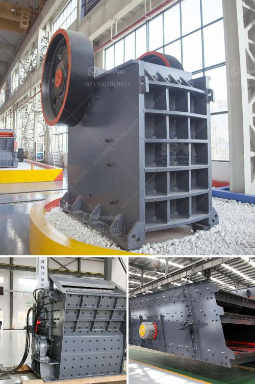

<h3>selling crusher grinding mill indonesia</h3>
Indonesia is one of the fastest-growing economies in Southeast Asia, with an annual growth rate of around 5%. This growth is primarily due to the country's thriving manufacturing sector, which has consistently attracted foreign investment and contributed significantly to the country's GDP. Consequently, there is a growing demand for machinery and equipment in various industries, including the mining and construction sectors.

One of the essential machines used in these sectors is a crusher grinding mill. A crusher grinding mill is used to reduce the sizes of material particles in various processes, such as crushing, grinding, and pulverizing. This equipment is crucial for processing raw materials into smaller particles, facilitating the production of other materials or products.

With Indonesia's growing industrialization and infrastructure development, there is a significant need for crusher grinding mills in the country. These machines are essential for the efficient operation of mining and construction projects, as they help process and transform raw materials into usable forms. As a result, the demand for crusher grinding mills in Indonesia is on the rise, creating lucrative opportunities for businesses operating in this sector.

To tap into the growing market potential, companies involved in manufacturing or distributing crusher grinding mills should explore Indonesia as a target market. However, entering a new market can be challenging, especially considering the country's unique business and cultural environment. Therefore, businesses need to thoroughly research and understand the Indonesian market dynamics before developing a market-entry strategy.

Building strong relationships with local partners and distributors is essential for successfully selling crusher grinding mills in Indonesia. Local partners can help navigate the complex business landscape, provide insights into customer preferences, and assist with establishing distribution channels. By collaborating with reliable local partners, companies can not only gain access to a vast network of potential customers but also ensure efficient after-sales services and support.

Since Indonesia has a diverse range of industries that require crusher grinding mills, it is essential to customize products to suit specific customer needs. Manufacturing companies must invest in research and development to create versatile and innovative products that cater to different industries. By offering customized solutions, businesses can gain a competitive edge and appeal to a broader customer base.

Additionally, it is crucial to comply with local regulations and standards when selling crusher grinding mills in Indonesia. This includes obtaining the necessary certifications, ensuring product quality, and adhering to safety standards. Developing a reputation for reliability, durability, and high performance is vital in gaining market trust and customer loyalty.

Expanding market opportunities for selling crusher grinding mills in Indonesia also require effective marketing strategies. Businesses should invest in targeted marketing campaigns, both online and offline, to reach potential customers. Utilizing digital platforms, such as social media and search engine optimization, can help companies penetrate the Indonesian market more effectively and generate leads.

In conclusion, Indonesia's booming economy and rapid industrialization present a fertile ground for selling crusher grinding mills. As the demand for these machines continues to grow in various industries, businesses can capitalize on expanding market opportunities. However, success in this market requires thorough research, building strong partnerships, developing customized products, and complying with local regulations. By adopting effective marketing strategies, companies can establish their presence and thrive in the Indonesian market.
<h3>Contact us</h3><ul><li><strong>Whatsapp:&nbsp;<a href="https://wa.me/8613661969651">+8613661969651</a></strong></li><li><a href="https://swt.shibang-china.com/?git&amp;zhl&amp;selling crusher grinding mill indonesia"><strong>Online Service(chat now)</strong></a></li></ul><h3>Related</h3><ul><li><a href='stone crushers in uttarakhand.md'>stone crushers in uttarakhand</a></li><li><a href='cobalt ore equipments nigeria.md'>cobalt ore equipments nigeria</a></li><li><a href='coal crushing plant for sale in south africa.md'>coal crushing plant for sale in south africa</a></li><li><a href='stone crusher machines in peru.md'>stone crusher machines in peru</a></li><li><a href='ball mills for 6 x 6 mining.md'>ball mills for 6 x 6 mining</a></li></ul>