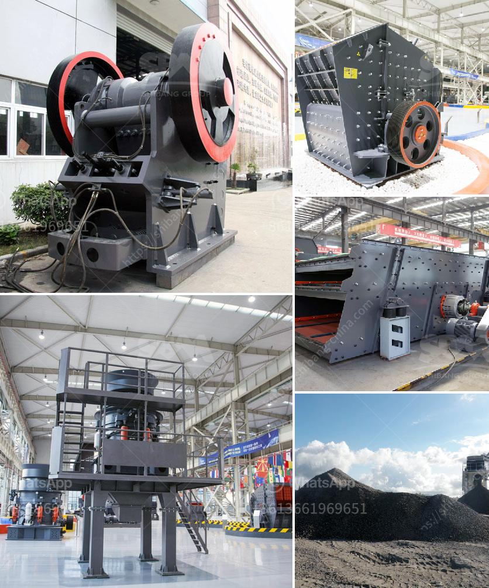

<h3>semi mobile crusher plant</h3>
Semi-mobile crusher plants are the perfect compromise between stationary plants and mobile crushers. These are highly efficient crushing machines that are ideal for partial and predictable crushing operations in large-scale mining, quarry, and construction projects.

Semi-mobile crusher plants provide a steady stream of material, allowing for processing on a continuous basis. This type of crushing plant is particularly suitable for crushing hard rock, such as granite, basalt, and similar materials. The crushing process is carried out between the two crushing jaws in a semi-mobile configuration.

One of the key advantages of a semi-mobile crusher plant is the flexibility to relocate the crusher as the mine progresses. Once the crusher has been positioned at the desired location, the operators can simply load the crusher onto a flatbed truck and move it to the next mining area. This is especially useful in large open-pit mines where the ore body is scattered across a vast area.

Furthermore, semi-mobile crusher plants are relatively easy to install and dismantle, which makes them an attractive option for companies with shorter project durations. The modular design of these plants allows for quick assembly and disassembly, reducing downtime and ensuring that production remains unaffected.

The semi-mobile crusher plants are equipped with crawlers that enable them to move around the mine site quickly. The crawler units can be driven by diesel engines or electric motors, providing the necessary power for the operation. These plants can even be remotely controlled to optimize productivity and minimize human intervention.

In terms of performance, semi-mobile crusher plants are designed to achieve high throughput levels. They are equipped with robust crushers that can handle large rocks and deliver consistent particle sizes. This ensures efficient crushing and reduces the need for additional stages of screening and crushing.

Furthermore, semi-mobile crusher plants are often equipped with integrated belt conveyors and vibrating screens, enabling the efficient handling and sorting of crushed materials. This reduces the need for additional processing equipment and simplifies the overall operation.

Semi-mobile crusher plants are also cost-effective solutions. Compared to stationary plants, they require less civil work, such as building foundations and retaining walls. This reduces the overall construction cost, making them an attractive option for both small and large mining companies.

Overall, semi-mobile crusher plants offer a range of benefits that make them an attractive option for companies looking to optimize their mining operations. Their flexibility, reliability, and efficiency make them well-suited for large-scale mining projects. With the ability to easily relocate and assemble, these plants are versatile and adaptable to changing mining conditions.
<h3>Contact us</h3><ul><li><strong>Whatsapp:&nbsp;<a href="https://wa.me/8613661969651">+8613661969651</a></strong></li><li><a href="https://swt.shibang-china.com/?git&amp;zhl&amp;semi mobile crusher plant"><strong>Online Service(chat now)</strong></a></li></ul><h3>Related</h3><ul><li><a href='used industrial stone crushers for sale.md'>used industrial stone crushers for sale</a></li><li><a href='bauxite manufacture equipment in india.md'>bauxite manufacture equipment in india</a></li><li><a href='construction waste recycling.md'>construction waste recycling</a></li><li><a href='silica sand manufacturing process.md'>silica sand manufacturing process</a></li><li><a href='stone hammer mills in china.md'>stone hammer mills in china</a></li></ul>