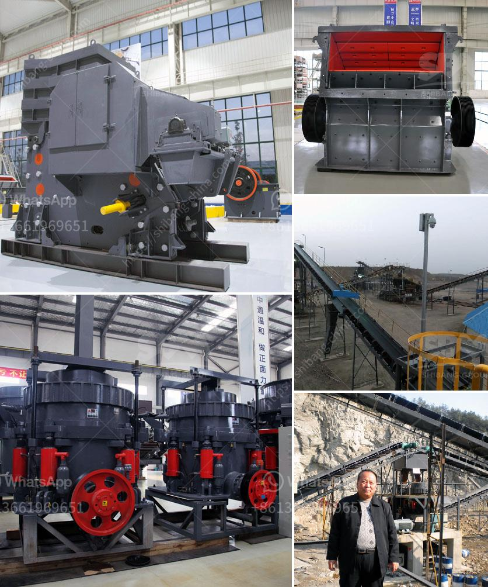

<h3>services of a crushing machine</h3>
In the vast world of manufacturing and construction, the need for efficient and reliable equipment is paramount. One such machine that has revolutionized the industry is the crushing machine. Designed to break down large rocks, concrete, asphalt, and other materials into smaller, more manageable pieces, crushing machines play a crucial role in various sectors like mining, construction, and recycling. In this article, we will explore the services provided by a crushing machine and how it contributes to improving overall efficiency and productivity.

A crushing machine can handle a wide range of materials, making it a versatile piece of equipment. Whether you need to crush rocks, concrete, asphalt, or even bricks, this machine is up to the task. The ability to process various materials with a single machine eliminates the need for multiple equipment, thereby simplifying the operation and reducing costs.

The primary function of a crushing machine is to break down the material into smaller fragments. By applying immense force, these machines effectively shatter large rocks or concrete into more manageable pieces. This process allows for easier transportation, storage, and recycling of materials. Additionally, crushing reduces material volume, saving valuable space in landfills and minimizing environmental impact.

Crushing machines are designed to improve efficiency and productivity, which translates to significant time and cost savings for businesses. With the ability to process large quantities of material in a relatively short time, these machines eliminate the need for manual labor, reducing associated expenses. Furthermore, the crushed material can be reused or sold, generating additional revenue streams.

Crushing machines employ different techniques to efficiently break down materials. Jaw crushers, for instance, apply compressive force to the material, resulting in it being crushed between two fixed jaws. On the other hand, cone crushers compress the material between a concave surface and a rotating mantle, effectively breaking it down. Impact crushers utilize the principle of rapid impact to crush material, while gyratory crushers use a rotating crushing head to achieve the desired outcome. Each technique caters to specific material types and desired output, providing flexibility in the crushing process.

Safety is a top priority in any industrial setting, and crushing machines are equipped with several safety features to protect operators. These include remote control functionalities, automated systems, robust protection guards, and emergency stop buttons. The presence of such safety mechanisms ensures a secure working environment, reducing the risk of accidents and injuries.

In summary, the services provided by a crushing machine are indispensable in numerous industries. From versatility in material types to the efficient crushing process, these machines offer a multitude of benefits. They save time and money, increase productivity, and contribute to the overall sustainability of operations by enabling recycling. With advanced safety features, operators can work confidently. As technology continues to advance, crushing machines will likely evolve further, maximizing their efficiency and transforming various industries.
<h3>Contact us</h3><ul><li><strong>Whatsapp:&nbsp;<a href="https://wa.me/8613661969651">+8613661969651</a></strong></li><li><a href="https://swt.shibang-china.com/?git&amp;zhl&amp;services of a crushing machine"><strong>Online Service(chat now)</strong></a></li></ul><h3>Related</h3><ul><li><a href='quarry equipment manufacturers.md'>quarry equipment manufacturers</a></li><li><a href='24 36 jaw crusher for sale usa.md'>24 36 jaw crusher for sale usa</a></li><li><a href='gypsum bord plant factorie price.md'>gypsum bord plant factorie price</a></li><li><a href='two roll mill supply in sri lanka.md'>two roll mill supply in sri lanka</a></li><li><a href='gold mining crusher machinery.md'>gold mining crusher machinery</a></li></ul>