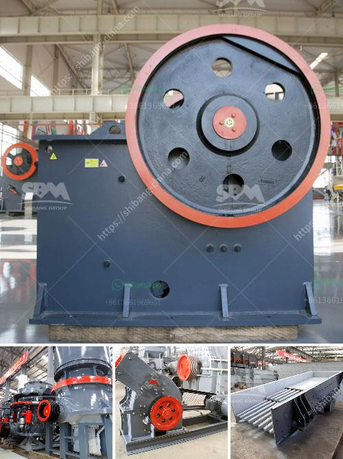

<h3>sewa mobile stone crusher di indonesia</h3>
Sewa mobile stone crusher di Indonesia has been a popular choice for many businesses in recent years. They have proved themselves to be a versatile and efficient option, allowing businesses to process stones and minerals with high precision and speed. Crushing stones and minerals has become a leading activity in numerous industries, including construction, metallurgy, and mining. In response to this demand, many stone crusher manufacturers have started offering their services on a rental basis.

Sewa mobile stone crusher di Indonesia is a challenge for the mining industries. Some businesses may not be able to afford the cost of machinery outright. Mobile stone crusher rentals providers in India still operate on a monthly contract, which gives customers convenient options for leasing equipment without obtaining hefty down payments or long-term rental agreements. This is beneficial for small to medium-sized businesses that may require machinery for a specific project or duration.

Advancements in technology have made it possible for rental providers to offer reliable and efficient machinery. Mobile stone crushers are capable of crushing stones and minerals into various sizes and specifications. These crushers can also break down waste materials like concrete and asphalt into reusable materials for new construction projects. They are available in different capacities and sizes, making them suitable for various purposes.

One of the key benefits of renting a mobile stone crusher is the convenience and flexibility it provides. For example, dealing with a rental company allows businesses to access a wider range of machinery and equipment than they would have been able to afford and manage on their own. Businesses don't have to worry about equipment maintenance, repairs, or storage when they choose to rent. The rental provider can take care of all these aspects, ensuring that the machine is always in good working order and ready to use.

Sewa mobile stone crusher di Indonesia is an ideal solution for businesses wanting to overcome logistical challenges in one go. Renting a crusher allows operators to carry out their work in a single location, eliminating the need for costly transportation. Additionally, renting eliminates the need for large excavation and stocking areas that are traditionally required when purchasing a stone crusher outright.

By choosing to rent a mobile stone crusher, businesses can also reduce their impact on the environment. These machines are designed to be highly efficient, minimizing waste and emissions. As a result, businesses can contribute to sustainable practices by opting for rental equipment.

In conclusion, sewa mobile stone crusher di Indonesia is a reliable and efficient option for businesses in the mining and construction industries. Renting a mobile crusher can save businesses valuable time and money while meeting the demands of their projects. It offers flexibility and convenience, allowing operators to move their machinery as needed without worrying about maintenance or storage. Moreover, renting can contribute to sustainable practices by reducing waste and emissions. By choosing to rent a mobile stone crusher, businesses set themselves up for success in their operations.
<h3>Contact us</h3><ul><li><strong>Whatsapp:&nbsp;<a href="https://wa.me/8613661969651">+8613661969651</a></strong></li><li><a href="https://swt.shibang-china.com/?git&amp;zhl&amp;sewa mobile stone crusher di indonesia"><strong>Online Service(chat now)</strong></a></li></ul><h3>Related</h3><ul><li><a href='gravel crusher prices philippines.md'>gravel crusher prices philippines</a></li><li><a href='rock crushing machine for concrete use.md'>rock crushing machine for concrete use</a></li><li><a href='controlling parameter of impact crusher.md'>controlling parameter of impact crusher</a></li><li><a href='gypsum powder production process pdf.md'>gypsum powder production process pdf</a></li><li><a href='screen clay from limestone rock.md'>screen clay from limestone rock</a></li></ul>