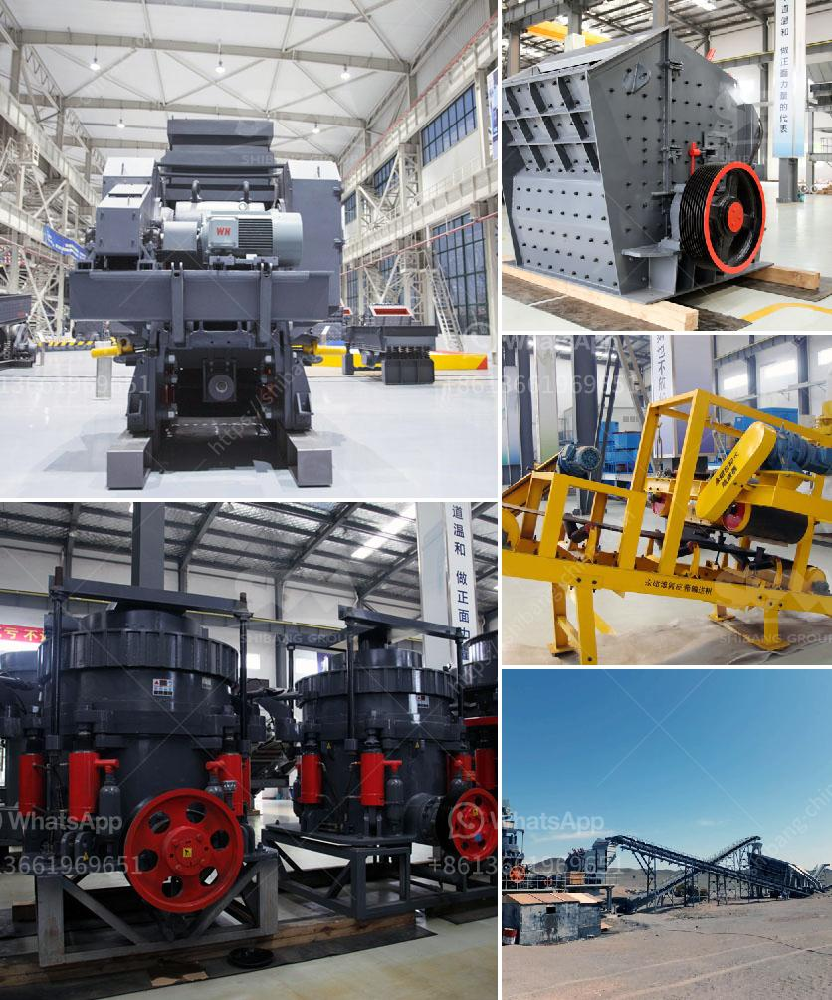

<h3>shaft hammer crusher hds</h3>
The shaft hammer crusher HDS is a robust and powerful crushing machine that is designed to break large rocks into smaller pieces. It is used for materials such as limestone, gypsum, chalk, clay, and marl, among others.

The machine uses a shaft-mounted hammer system to bring down the rock, and further crushes it by impacting against an adjustable breaker plate. The material is fed into the machine from the top and falls into the crushing chamber. There, it is hit by the rotating hammers, which reduce the size of the material.

One of the key features of the HDS is its compact design. This allows it to be easily integrated into existing crushing plants or operated in standalone mode. The machine is also equipped with a hydraulic opening mechanism, which facilitates quick and easy maintenance and inspection.

Another advantage of the shaft hammer crusher HDS is its high efficiency and low operating costs. It is designed to crush hard and abrasive materials, and its powerful impact forces reduce the wear and tear on the crushing tool. This results in a longer service life and lower maintenance costs.

Furthermore, the HDS offers a wide range of applications. It can be used in cement plants, mining operations, and quarries, as well as in the recycling industry. Its ability to handle different types of materials makes it a versatile choice for various crushing tasks.

In terms of safety, the HDS is equipped with a safety coupling, which prevents damage to the crushing tool and the machine in case of an overload. It also has a comprehensive safety system, including an automatic lubrication unit and an emergency stop button.

The shaft hammer crusher HDS is a reliable and powerful crushing machine that is designed to handle even the toughest materials. Its compact design and high efficiency make it a cost-effective solution for many crushing applications. Whether used in cement plants, mining operations, or recycling facilities, it delivers consistent and reliable performance.

In conclusion, the shaft hammer crusher HDS is a powerful and efficient crushing machine that offers a host of benefits. Its compact design, high efficiency, and low operating costs make it a popular choice for various crushing applications. With its robust construction and comprehensive safety features, it ensures reliable and safe operation.
<h3>Contact us</h3><ul><li><strong>Whatsapp:&nbsp;<a href="https://wa.me/8613661969651">+8613661969651</a></strong></li><li><a href="https://swt.shibang-china.com/?git&amp;zhl&amp;shaft hammer crusher hds"><strong>Online Service(chat now)</strong></a></li></ul><h3>Related</h3><ul><li><a href='ball mill grinding china.md'>ball mill grinding china</a></li><li><a href='rubber conveyor belt manufacturers in turkey.md'>rubber conveyor belt manufacturers in turkey</a></li><li><a href='marble crushing equipment.md'>marble crushing equipment</a></li><li><a href='hammer mill design plans pdf mtm crusher.md'>hammer mill design plans pdf mtm crusher</a></li><li><a href='crusher rock for sale.md'>crusher rock for sale</a></li></ul>