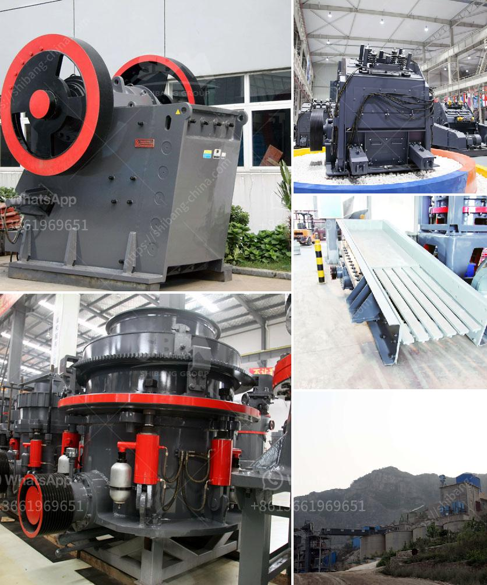

<h3>silica quartz crushing plant</h3>
Silica quartz, also known as crystalline silica or quartz dust, is a mineral that is commonly found in nature. It is one of the most common components of rocks and sand. Silica quartz crushing plant is used to process sand, gravel, and stone which contains high levels of silica. These silica quartz crushing plants are equipped with different crushing equipment, such as jaw crusher, cone crusher, impact crusher, mobile crusher, and vibrating screens.

In terms of crushing equipment, the types of crushers used in silica quartz crushing plants include jaw crusher, cone crusher, impact crusher, and mobile crusher. Jaw crusher and cone crusher are typically used for crushing large silica quartz stones into small particles. Both jaw crusher and cone crusher can operate in harsh environments and are suitable for primary crushing.

Impact crusher and mobile crusher are used for secondary crushing. The silica quartz particles are further crushed into smaller particles by the impact crusher or crushed by the mobile crusher. These crushing equipment options offer great flexibility for various crushing requirements.

Vibrating screens are crucial in the silica quartz crushing plant as they are responsible for separating the crushed silica quartz particles into different sizes required for different applications. The vibrating screens play a significant role in ensuring the quality and uniformity of the final product.

The silica quartz crushing plants are designed to handle a wide range of crushing applications and are equipped with various conveying and screening equipment. This enables the plants to transport the materials from the quarry to the crushing site, ensuring smooth and efficient operations.

In conclusion, silica quartz crushing plants are essential for the sand, gravel, and stone industries. They offer efficient and reliable crushing solutions for mineral processing applications. The wide range of crushing equipment available for these plants ensures high-quality and uniform products, meeting the diverse needs of customers in different industries.
<h3>Contact us</h3><ul><li><strong>Whatsapp:&nbsp;<a href="https://wa.me/8613661969651">+8613661969651</a></strong></li><li><a href="https://swt.shibang-china.com/?git&amp;zhl&amp;silica quartz crushing plant"><strong>Online Service(chat now)</strong></a></li></ul><h3>Related</h3><ul><li><a href='price of stone crusher machine in nigeria.md'>price of stone crusher machine in nigeria</a></li><li><a href='quartz silica old plant sale at telgana.md'>quartz silica old plant sale at telgana</a></li><li><a href='stone quarry crusher project report pdf.md'>stone quarry crusher project report pdf</a></li><li><a href='coal washing plant in philippines south africa.md'>coal washing plant in philippines south africa</a></li><li><a href='wet grinding mill china.md'>wet grinding mill china</a></li></ul>