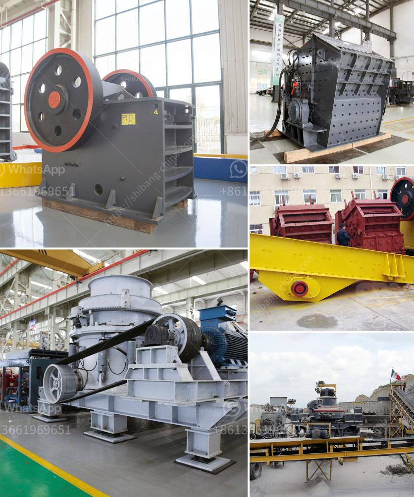

<h3>silica quartz powder processing</h3>
Silica quartz powder, also known as white silica sand or industrial sand, is a major component of glass, ceramics, and construction materials. It is commonly used in applications like oil well drilling, hydraulic fracturing, and metal casting. As the demand for these products continues to grow, so does the need for efficient silica quartz powder processing.

The processing of silica quartz powder begins with crushing the material into smaller pieces. This is accomplished by using jaw crushers or mills that break down the larger rocks into smaller, more manageable sizes. The crushed material is then milled to further refine its particle size and improve its purity.

Next, the milled silica quartz powder undergoes a series of washing and sieving processes to remove impurities. This helps enhance the quality and consistency of the final product. The washing process involves using water to remove any remaining contaminants and to separate the finer particles from the coarser ones. After washing, the powder is dried to remove any moisture and prepared for the final steps of processing.

One crucial step in silica quartz powder processing is the removal of iron content. Iron impurities in quartz can affect the quality and clarity of glass and ceramics, making it essential to eliminate them. A variety of techniques can be employed to achieve this, including magnetic separation, air classification, and chemical leaching. These methods effectively remove iron impurities and improve the purity of the silica quartz powder.

To meet specific customer requirements, the processed silica quartz powder may undergo further refinement. This can include treatments such as surface coating, calcination, or micronization. Surface coating involves applying a thin layer of chemicals to enhance the powder's performance, such as increasing its moisture resistance or improving its dispersibility in liquids. Calcination involves heating the powder at high temperatures to improve its thermal stability or to modify its particle size and shape. Micronization, on the other hand, reduces the particle size of the powder, making it suitable for specialized applications like pharmaceuticals or electronics.

In conclusion, silica quartz powder processing is a complex and multistep procedure that involves crushing, milling, washing, sieving, and various refining techniques. Each step is crucial to achieve the desired quality, purity, and particle size distribution of the final product. With the growing demand for silica quartz powder in various industries, it is essential to develop efficient processing methods that can meet these requirements consistently. By continuously improving and optimizing the processing techniques, manufacturers can ensure the supply of high-quality silica quartz powder for a wide range of applications.
<h3>Contact us</h3><ul><li><strong>Whatsapp:&nbsp;<a href="https://wa.me/8613661969651">+8613661969651</a></strong></li><li><a href="https://swt.shibang-china.com/?git&amp;zhl&amp;silica quartz powder processing"><strong>Online Service(chat now)</strong></a></li></ul><h3>Related</h3><ul><li><a href='cone crusher 100tph prices in india.md'>cone crusher 100tph prices in india</a></li><li><a href='chain conveyors crushers.md'>chain conveyors crushers</a></li><li><a href='mobile impact crusher in road construction.md'>mobile impact crusher in road construction</a></li><li><a href='washing plant suppliers in mozambique.md'>washing plant suppliers in mozambique</a></li><li><a href='gypsum powder grinding mill price in pakistan.md'>gypsum powder grinding mill price in pakistan</a></li></ul>