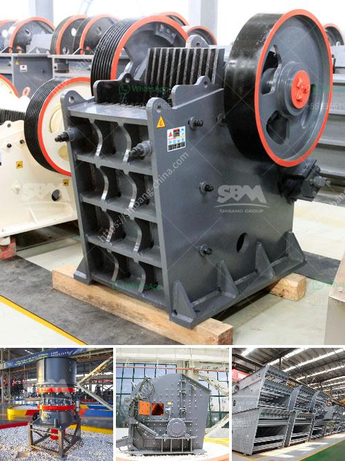

<h3>silica sand crusher machine</h3>
Silica sand crusher machine is an important part of the silica sand production line, which is widely used in various industries such as mining, metallurgy, building materials, highways, railways, water conservancy, and chemical industries. It has the advantages of large crushing ratio, uniform product size, low energy consumption, and easy maintenance. Here, I will introduce the silica sand crusher machine in detail.

First of all, the silica sand is evenly fed into the jaw crusher by the vibrating feeder for primary crushing. Then, the coarse silica sand is transported to the cone crusher by the belt conveyor for secondary crushing. After crushing, the silica sand particles will be sieved through the vibrating screen.

The qualified silica sand particles are sent to the sand making machine for further shaping. This machine uses the principle of "stone hitting stone" to optimize the grain shape of the finished silica sand. The particles with good grain shape are screened out through the vibrating screen, and the remaining particles are sent back to the sand making machine for further crushing.

Finally, the silica sand with the required fineness is sent to the sand washing machine through the belt conveyor for cleaning. The cleaned silica sand is sent to the finished product pile through the belt conveyor or directly discharged.

In conclusion, the silica sand crusher machine plays an important role in silica sand production. It not only enhances the grain shape and purity of the finished silica sand but also reduces the production cost while improving the production efficiency. With the development of technology, there are various types and models of silica sand crusher machines available in the market, providing customers with more choices.
<h3>Contact us</h3><ul><li><strong>Whatsapp:&nbsp;<a href="https://wa.me/8613661969651">+8613661969651</a></strong></li><li><a href="https://swt.shibang-china.com/?git&amp;zhl&amp;silica sand crusher machine"><strong>Online Service(chat now)</strong></a></li></ul><h3>Related</h3><ul><li><a href='stained glass grinder machine for sale.md'>stained glass grinder machine for sale</a></li><li><a href='estimated cost for cement grinding mill.md'>estimated cost for cement grinding mill</a></li><li><a href='project report of lime processing unit.md'>project report of lime processing unit</a></li><li><a href='coal crusher 6mm.md'>coal crusher 6mm</a></li><li><a href='cobalt ore equipments nigeria.md'>cobalt ore equipments nigeria</a></li></ul>