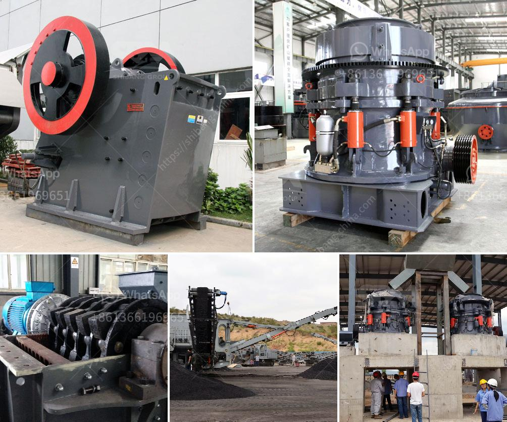

<h3>silica sand grinding</h3>
Silica sand is a mineral resource that is commonly used in a wide range of industrial applications. It is renowned for its high purity and consistency, which makes it a viable option for various purposes, including glass making, ceramics, and metal casting. To achieve the desired particle size distribution and grinding consistency of silica sand, grinding equipment is necessary. In this article, we will explore the process of silica sand grinding and its significance in various industries.

Silica sand grinding involves a series of processes to achieve the desired particle size distribution and surface area. The equipment used in these processes may vary, but common equipment includes ball mills, rod mills, and vertical mills. Silica sand particles are fed into the mill, then crushed and ground through a combination of air and skilled milling media to achieve the desired fineness.

The grinding process is crucial in determining the quality and consistency of the final product. It is essential to grind silica sand efficiently to ensure that the particles are of the desired size and meet specific requirements. The grinding process also influences other factors, such as the absorption strength, density, and chemical properties of silica sand.

When grinding silica sand, several factors need to be considered to optimize the grinding process. The choice of grinding equipment depends on the particle size requirements, the hardness of the material, and the desired output capacity. Additionally, the grinding media used, such as ceramic balls or steel balls, can affect the grinding efficiency and end product quality.

Silica sand grinding is widely used in a variety of industries. One of the most well-known applications is glass making. Silica sand is a primary component in the production of glass, and the grinding process is essential to ensure that the final product meets stringent quality standards. The particle size distribution of silica sand must be consistent to achieve clarity, strength, and transparency in glass products.

In the ceramics industry, grinding silica sand helps create the desired texture and smoothness in ceramic compounds. It is used in the production of ceramic tiles, pottery, and sanitaryware, where a fine and consistent particle size is necessary for proper moldability and aesthetics.

Another application of silica sand grinding is in metal casting. Silica sand is commonly used as a molding material in foundries. The grinding process helps to achieve the necessary particle size range that ensures the proper binding and strength of molds when casting metals.

In conclusion, silica sand grinding is a critical process in various industries, including glass making, ceramics, and metal casting. Achieving the desired particle size distribution and grinding consistency is essential to produce quality products. The choice of grinding equipment, grinding media, and optimization of process parameters play a significant role in achieving these goals. With the right approach and equipment, the grinding of silica sand can result in consistent, high-quality products that meet industry standards and customer expectations.
<h3>Contact us</h3><ul><li><strong>Whatsapp:&nbsp;<a href="https://wa.me/8613661969651">+8613661969651</a></strong></li><li><a href="https://swt.shibang-china.com/?git&amp;zhl&amp;silica sand grinding"><strong>Online Service(chat now)</strong></a></li></ul><h3>Related</h3><ul><li><a href='zinc crusher machine zimbabwe.md'>zinc crusher machine zimbabwe</a></li><li><a href='puzzolana 50 tph crusher plant prices.md'>puzzolana 50 tph crusher plant prices</a></li><li><a href='mobile crushers in malaysia.md'>mobile crushers in malaysia</a></li><li><a href='talc mining crusher costs.md'>talc mining crusher costs</a></li><li><a href='prices of coal pulverizers.md'>prices of coal pulverizers</a></li></ul>