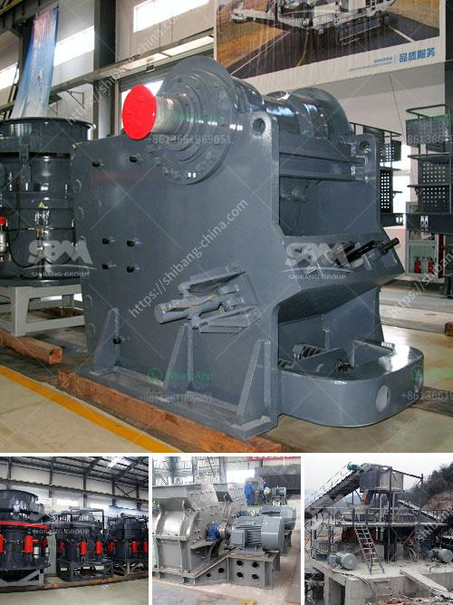

<h3>silica sand manufacturing process</h3>
Silica sand, also known as quartz sand, is a raw material commonly used in the production of glass, ceramics, and various other industrial products. It is one of the main components in cement and plays a crucial role in the construction industry. Silica sand manufacturing plants are the key processing facilities in the production of this versatile material.

The process starts with crushing quartz rocks into smaller particles. The rocks are then subjected to extensive grinding to achieve the desired grain size. This grinding process uses high-speed rotating equipment to effectively break down the rocks and reduce them to a uniform size. The resulting material is often referred to as ground silica or silica flour.

Once the desired particle size is achieved, the ground silica is then washed to remove any impurities such as clay, dust, and organic matter. This washing process involves multiple stages, including classification, attrition scrubbing, and flotation. It ensures that the final product meets the strict quality requirements of various industries.

After washing, the silica sand is dried using industrial dryers. This step further removes any remaining moisture and reduces the risk of mold or bacteria growth during storage and transportation. Proper drying is essential to maintain the integrity and quality of the material.

The dried silica sand is then screened and separated into different grades using vibrating screens. This classification process ensures that the silica sand meets specific size specifications required by different industries. The various grades are typically categorized as fine, medium, and coarse.

The obtained silica sand is carefully transported to storage facilities, where it is stored in large silos or warehouses before being shipped to customers. Silica sand has a wide range of applications, including glass production, ceramics, foundry, and hydraulic fracturing (fracking).

In the glass industry, silica sand is a major ingredient in the production of glass bottles, windows, and other glass products. Due to its excellent heat resistance and low thermal expansion, it is highly preferred for high-quality glass manufacturing processes. Its stable chemical properties also make it an ideal ingredient for ceramics, such as pottery, porcelain, and sanitary ware.

Silica sand is also extensively used in the foundry industry due to its ability to withstand high temperatures. It is used as a molding material in metal casting, providing the desired shape and properties to the final product. Moreover, the oil and gas industry utilizes silica sand in fracking operations to extract oil and gas from shale formations.

In conclusion, the manufacturing process of silica sand involves several crucial steps, including crushing, grinding, washing, drying, screening, and grading. Each of these steps contributes to the production of high-quality silica sand used in various industries, such as glass, ceramics, foundry, and oil and gas. Silica sand has become an indispensable material in our daily lives, playing a vital role in numerous products and applications.
<h3>Contact us</h3><ul><li><strong>Whatsapp:&nbsp;<a href="https://wa.me/8613661969651">+8613661969651</a></strong></li><li><a href="https://swt.shibang-china.com/?git&amp;zhl&amp;silica sand manufacturing process"><strong>Online Service(chat now)</strong></a></li></ul><h3>Related</h3><ul><li><a href='mobile screening plant.md'>mobile screening plant</a></li><li><a href='sand making machine from china.md'>sand making machine from china</a></li><li><a href='mill grinding plants balls.md'>mill grinding plants balls</a></li><li><a href='carbomer ball mill.md'>carbomer ball mill</a></li><li><a href='process of making talcum powder.md'>process of making talcum powder</a></li></ul>