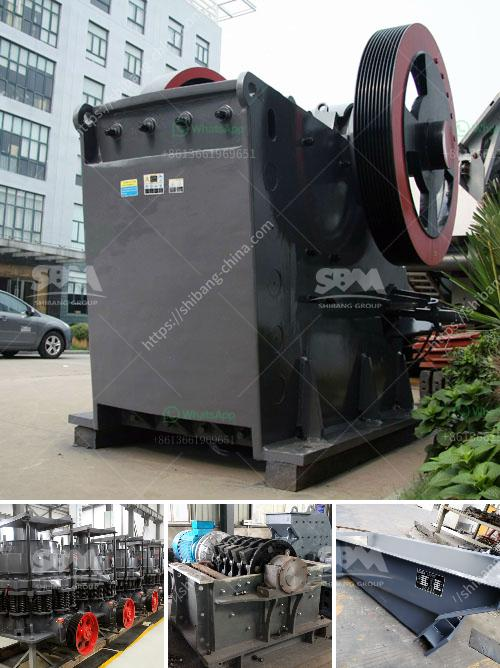

<h3>silica sand mines in maharashtra</h3>
Silica sand mines in Maharashtra have been at the center of controversy for quite some time now. These mines, which are responsible for the extraction of silica sand, a key ingredient in many industrial and construction processes, have become a bone of contention between various stakeholders. With government agencies, local communities, and environmental activists expressing concerns about the environmental impact of these mines, the issue has gained considerable attention.

Silica sand, also known as industrial sand, is widely used in the manufacturing of various products, including glass, ceramics, and concrete. Its unique properties, such as high purity and high heat resistance, make it an essential component in many industrial processes. Maharashtra, known for its vast reserves of silica sand, has seen a significant increase in mining activities to meet the growing demand.

However, the growing number of silica sand mines in Maharashtra has led to environmental and social concerns. One of the major concerns surrounding these mines is the exploitation of natural resources and the resulting environmental degradation. The extraction of silica sand involves the removal of topsoil and vegetation, leading to soil erosion and loss of biodiversity. It also alters the natural landscape and disrupts local ecosystems.

Additionally, the mining process itself can pose a threat to the environment. The use of heavy machinery and explosives in the extraction process generates noise and air pollution. The transportation of silica sand from the mines to processing plants also contributes to air pollution and increased vehicular traffic, further impacting the environment.

Another issue associated with silica sand mining in Maharashtra is the impact on local communities. These mines often encroach upon agricultural land, displacing farmers and affecting their livelihoods. The dust and noise generated from mining activities also have adverse health effects on nearby communities, leading to respiratory problems and other health issues.

Environmental activists and local communities have been vocal in their opposition to silica sand mining in Maharashtra. They argue that the government needs to regulate and monitor these mining operations to protect the environment and the rights of local communities. Some activists have even taken legal action to halt mining activities and seek compensation for the affected communities.

The government of Maharashtra has recognized the concerns raised by environmentalists and local communities and has taken some steps to address the issues. The state has introduced regulations and guidelines to ensure sustainable mining practices, including measures to control air and water pollution. Authorities have also emphasized the importance of conducting environmental impact assessments before granting mining licenses, although implementation and enforcement of these regulations remain key challenges.

Silica sand mines in Maharashtra play a crucial role in fulfilling the demand for industrial sand, which is essential for various industries. However, it is imperative to strike a balance between economic development and environmental sustainability. Strict regulations, robust monitoring mechanisms, and meaningful engagement with local communities are essential to ensure that silica sand mining in Maharashtra is carried out responsibly, minimizing the ecological and social impact associated with these activities.
<h3>Contact us</h3><ul><li><strong>Whatsapp:&nbsp;<a href="https://wa.me/8613661969651">+8613661969651</a></strong></li><li><a href="https://swt.shibang-china.com/?git&amp;zhl&amp;silica sand mines in maharashtra"><strong>Online Service(chat now)</strong></a></li></ul><h3>Related</h3><ul><li><a href='iron ore beneficiation technology.md'>iron ore beneficiation technology</a></li><li><a href='crushers of crushers.md'>crushers of crushers</a></li><li><a href='ball mill grinding china.md'>ball mill grinding china</a></li><li><a href='processing of cement crusher.md'>processing of cement crusher</a></li><li><a href='hammer mills for sand.md'>hammer mills for sand</a></li></ul>