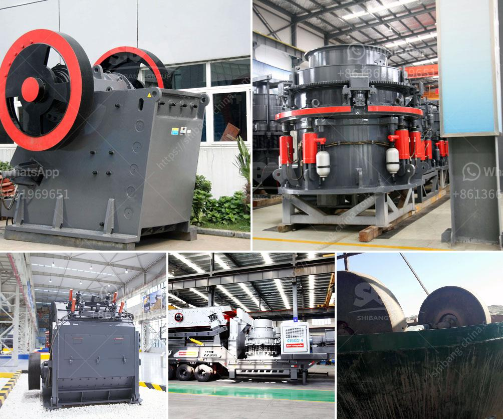

<h3>silica sand screening plant</h3>
A silica sand screening plant is an essential piece of equipment for industrial production and processing. It is designed to separate granulated particles of sand from impurities and other materials, ensuring efficient and continuous operation.

Silica sand, also known as quartz sand, is a common material used in various industries, including glass manufacturing, foundry, construction, ceramics, and agriculture. It consists of silicon dioxide (SiO2) in crystal form and has high hardness and resistance to high temperatures. These properties make it ideal for a wide range of applications.

The main purpose of a silica sand screening plant is to separate the granulated particles of sand into multiple sizes, ranging from fine to coarse. This process ensures that the material is suitable for its designated use and meets the specific requirements of different industries.

A typical silica sand screening plant consists of a vibrating feeder, a jaw crusher or impact crusher, a vibrating screen, and a belt conveyor. The vibrating feeder delivers the raw materials into the jaw crusher or impact crusher, where the particles are crushed to the desired size. The vibrating screen then separates the crushed particles into different sizes, and the belt conveyor transports the screened material to its destination.

The size of a silica sand screening plant can vary depending on the production capacity required. Plants with a capacity of 100-300 tons per hour are commonly used in large-scale industrial applications. These plants are often equipped with advanced screening technology, such as high-frequency screens or inclined vibrating screens, to achieve efficient separation and maximize productivity.

In conclusion, a silica sand screening plant plays a crucial role in the production and processing of this valuable material. By separating the granulated particles into different sizes, it ensures that the sand meets the specific requirements of various industries. With the right equipment and technology, these plants can operate continuously and efficiently, contributing to the success of industrial processes.
<h3>Contact us</h3><ul><li><strong>Whatsapp:&nbsp;<a href="https://wa.me/8613661969651">+8613661969651</a></strong></li><li><a href="https://swt.shibang-china.com/?git&amp;zhl&amp;silica sand screening plant"><strong>Online Service(chat now)</strong></a></li></ul><h3>Related</h3><ul><li><a href='list of mini cement plants in gujarat.md'>list of mini cement plants in gujarat</a></li><li><a href='harga stone crusher 250 ton jam indonesia.md'>harga stone crusher 250 ton jam indonesia</a></li><li><a href='cost per hour mobile crusher.md'>cost per hour mobile crusher</a></li><li><a href='three roll mills supplier.md'>three roll mills supplier</a></li><li><a href='concrete aggregate crushing plant.md'>concrete aggregate crushing plant</a></li></ul>