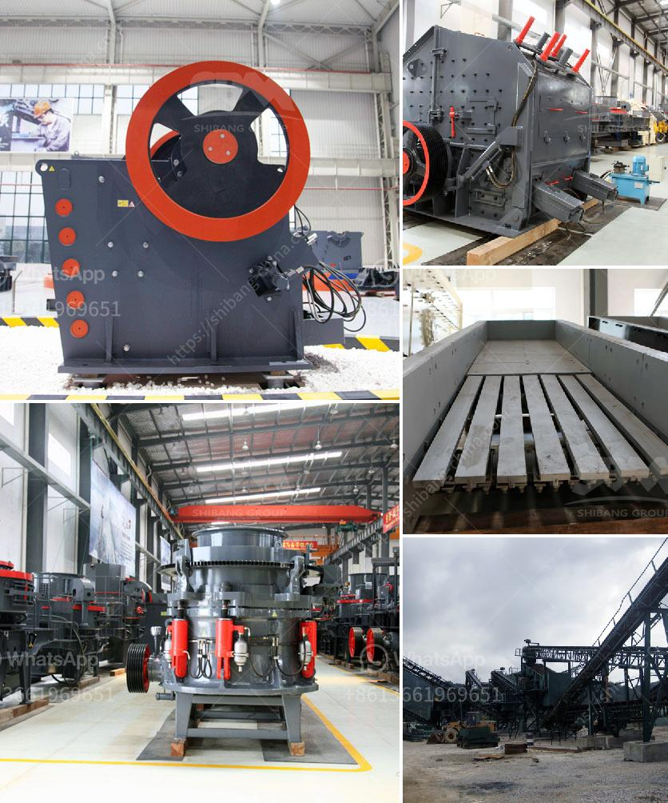

<h3>silica sand washing and grinding</h3>
Silica sand is a naturally occurring granular material composed of quartz and other minerals. It is widely used in various industrial applications, such as glass manufacturing, foundries, ceramics, and construction, due to its high resistance to heat and ability to withstand harsh environmental conditions.

However, raw silica sand often contains impurities like clay, iron oxide, and organic matter, which can reduce its quality and hinder its usability. In order to meet industrial standards, silica sand needs to undergo washing and grinding processes to remove impurities and increase its purity.

Silica sand washing is the simplest and most commonly used method to remove impurities from silica sand. It involves washing the sand with water, creating a slurry, and then removing the impurities through specific gravity separation. This process is highly effective in removing clay and other fine particles that can cause the sand to clump together or reduce its strength.

Grinding silica sand is another essential process to remove impurities and improve its particle size distribution. The grinding process can be done with either dry or wet methods, depending on the end-use application. Dry grinding is generally preferred for applications where a higher level of purity is required, while wet grinding is commonly used for applications where particle size reduction is desired.

The grinding process involves crushing the silica sand to the desired size and then transferring it to a grinding mill for further size reduction. The ground material is then classified by a classifier, and the oversized particles are returned to the grinding mill for re-processing. This process ensures that the final product has a consistent particle size distribution and is free from impurities.

Both silica sand washing and grinding processes are crucial steps in producing high-quality silica sand. These processes not only remove impurities and improve the purity of silica sand but also enhance its usability in various industrial applications. By properly washing and grinding silica sand, manufacturers can produce a product that meets the stringent requirements of their customers and contributes to the overall efficiency and success of their operations.
<h3>Contact us</h3><ul><li><strong>Whatsapp:&nbsp;<a href="https://wa.me/8613661969651">+8613661969651</a></strong></li><li><a href="https://swt.shibang-china.com/?git&amp;zhl&amp;silica sand washing and grinding"><strong>Online Service(chat now)</strong></a></li></ul><h3>Related</h3><ul><li><a href='iron ore crushing equipment in mexico.md'>iron ore crushing equipment in mexico</a></li><li><a href='iron ore beneficiation technology.md'>iron ore beneficiation technology</a></li><li><a href='rock crushers manufacturers.md'>rock crushers manufacturers</a></li><li><a href='sell jaw crusher.md'>sell jaw crusher</a></li><li><a href='stone crusher second hand south africa.md'>stone crusher second hand south africa</a></li></ul>