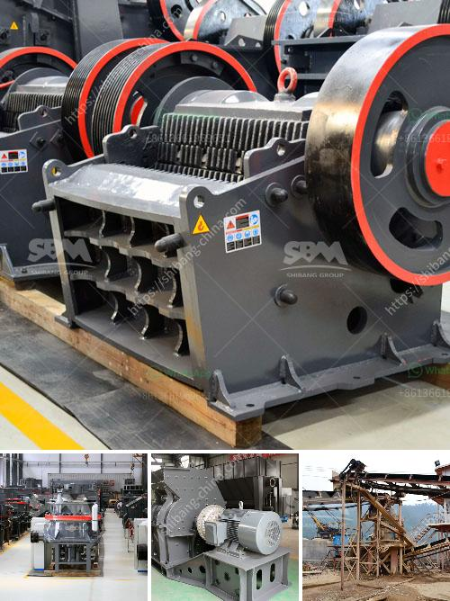

<h3>silica sand washing plant</h3>
A silica sand washing plant is an essential piece of equipment used for the production of high-grade silica sand. The plant removes dirt and impurities from the final product to ensure high quality and to meet industry standards on different particle size fractions. The plant is designed for optimum efficiency, using advanced technology and state-of-the-art equipment.

The silica sand washing plant operates in a continuous mode, providing a reliable and consistent supply of sand to meet the ever-increasing demands of various industries. It utilizes a series of gravity separation processes to remove unwanted materials and achieve the desired grades of silica sand. The process includes screening, scrubbing, and dewatering, ensuring the final sand product is clean, dry, and ready for use.

The importance of a silica sand washing plant lies in its ability to remove impurities, such as clay, silt, and organic matter, that can negatively impact the quality of the final product. This is crucial, especially for industries that require high-purity silica sand, such as glass manufacturing and foundries. The washing process also ensures the removal of iron oxide, which can cause discoloration in the final product.

In addition to producing high-grade silica sand, the washing plant also contributes to environmental sustainability. By removing impurities and recycling water, it reduces the need for freshwater intake and minimizes waste discharge into the environment. The plant is equipped with advanced water management systems, such as settling ponds and water recycling units, ensuring the efficient use and conservation of water resources.

In conclusion, a silica sand washing plant is an indispensable piece of equipment for the production of high-grade silica sand. It enables industries to meet stringent quality standards, produces clean and dry sand, and contributes to environmental sustainability. With its advanced technology and efficient processes, the plant ensures a reliable supply of high-quality silica sand for various applications.
<h3>Contact us</h3><ul><li><strong>Whatsapp:&nbsp;<a href="https://wa.me/8613661969651">+8613661969651</a></strong></li><li><a href="https://swt.shibang-china.com/?git&amp;zhl&amp;silica sand washing plant"><strong>Online Service(chat now)</strong></a></li></ul><h3>Related</h3><ul><li><a href='harga mesin pemecah batu kapasitas satu ton.md'>harga mesin pemecah batu kapasitas satu ton</a></li><li><a href='stone crusher machine in saudi arabia.md'>stone crusher machine in saudi arabia</a></li><li><a href='crushing and screening process.md'>crushing and screening process</a></li><li><a href='best prices for portable impact crushers.md'>best prices for portable impact crushers</a></li><li><a href='different size mining cone crusher.md'>different size mining cone crusher</a></li></ul>