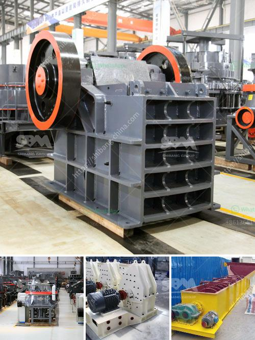

<h3>silica sand washing</h3>
Silica sand has many uses, both in industrial and commercial settings. It is widely used in construction, glass manufacturing, water filtration, and even hydraulic fracturing in the oil and gas industry. However, before it can be used in any application, the silica sand needs to be cleaned and purified. This is where silica sand washing comes in.

Silica sand washing is the process of extracting impurities such as clay, silt, and organic matter from the sand particles. The process involves washing the sand with water to remove the impurities and achieve a high-quality product suitable for various applications. The resulting washed sand is generally clean, free from contaminants, and has a reduced level of fines.

There are various methods used for silica sand washing, depending on the desired outcome and the characteristics of the sand. One common method is through the use of a sand washing machine, which uses water to separate the fine sand particles from the impurities. The machine agitates the sand and water mixture, causing the impurities to be suspended in the water and then removed through overflow channels.

Another method is through the use of a sand washing plant, which is a more advanced process. The sand washing plant consists of several components, including a vibrating screen, a sand washer, and a hydrocyclone. The vibrating screen separates the sand into different sizes, while the sand washer removes the impurities. The hydrocyclone further separates the sand particles by size and removes any remaining impurities.

Silica sand washing is an essential process in ensuring the quality and purity of the silica sand used in various industries. By removing the impurities, the washed sand provides a consistent and reliable material for construction, glass manufacturing, water filtration, and other applications. The process also helps in improving the overall efficiency and performance of the final product.

In conclusion, silica sand washing is a crucial step in the production of high-quality silica sand. It involves the removal of impurities such as clay, silt, and organic matter to ensure a clean and refined product. Various methods, including the use of sand washing machines and sand washing plants, are employed to achieve the desired level of cleanliness. The process not only improves the quality of the silica sand but also enhances its suitability for a wide range of industrial and commercial applications.
<h3>Contact us</h3><ul><li><strong>Whatsapp:&nbsp;<a href="https://wa.me/8613661969651">+8613661969651</a></strong></li><li><a href="https://swt.shibang-china.com/?git&amp;zhl&amp;silica sand washing"><strong>Online Service(chat now)</strong></a></li></ul><h3>Related</h3><ul><li><a href='precipitated calcium carbonate process.md'>precipitated calcium carbonate process</a></li><li><a href='ballast crusher line.md'>ballast crusher line</a></li><li><a href='powder ball milling machines.md'>powder ball milling machines</a></li><li><a href='stone crusher conveyors belt price.md'>stone crusher conveyors belt price</a></li><li><a href='material using for making talcum powder.md'>material using for making talcum powder</a></li></ul>