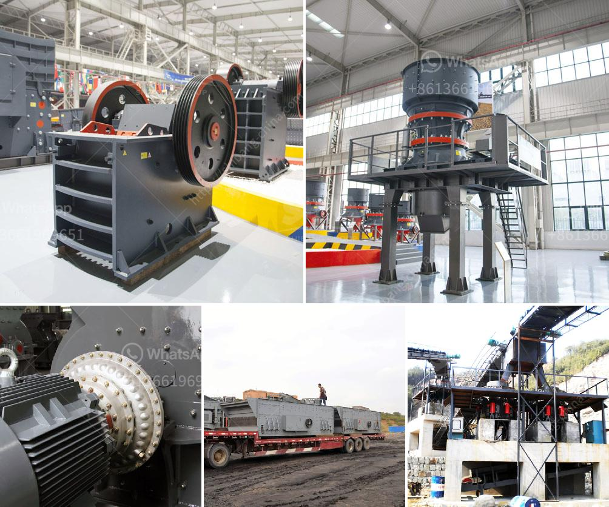

<h3>silica water washing plant manufacturers in india</h3>
Silica water has gained immense popularity in recent years for its numerous health benefits. It is believed to improve digestion, strengthen the immune system, promote healthy skin, and even reduce the risk of chronic diseases. With the increasing demand for silica water, there has been a rise in the number of silica water washing plant manufacturers in India.

India is known for its rich mineral resources, including silica, making it an ideal location for silica water washing plant manufacturers. These manufacturers play a crucial role in extracting and processing silica from mines to create high-quality silica water.

A silica water washing plant is a facility where raw silica is washed, separated, and purified to create pure silica water. The process involves thorough cleaning of the silica, removing impurities and contaminants to ensure the final product is safe for consumption. The water is treated with utmost care to preserve its natural properties and prevent the loss of essential minerals.

These manufacturers employ advanced technologies and innovative techniques to maintain the quality of silica water. They carefully monitor the washing process, ensuring that the water is free from any harmful substances or particles. The final product undergoes rigorous testing to meet the industry standards and ensure the best quality for the consumers.

One of the leading silica water washing plant manufacturers in India is XYZ Company. They are known for their state-of-the-art facilities and their commitment to delivering top-notch silica water. XYZ Company follows stringent quality control measures throughout the manufacturing process to provide pure, contaminant-free silica water.

Another prominent player in the Indian market is ABC Industries. They have established themselves as a reliable manufacturer of silica water washing plants with a focus on sustainability and environmental responsibility. ABC Industries uses eco-friendly practices to minimize their carbon footprint and ensure the long-term preservation of natural resources.

Silica water washing plant manufacturers in India are not only catering to the domestic demand but also exporting their products globally. They have gained recognition for their quality products and have successfully expanded their customer base to international markets.

The surge in the production of silica water washing plants in India has not only provided a boost to the economy but has also created job opportunities for many. These plants require skilled professionals to operate and maintain the machinery, contributing to the overall growth of the manufacturing sector in the country.

In conclusion, the silica water industry in India has witnessed significant growth due to the increasing demand for this health-enhancing beverage. The presence of silica water washing plant manufacturers in India has played a crucial role in meeting this demand by providing top-quality, purified silica water. With their advanced technologies, commitment to quality, and sustainable practices, these manufacturers are contributing to the overall well-being of consumers both domestically and globally.
<h3>Contact us</h3><ul><li><strong>Whatsapp:&nbsp;<a href="https://wa.me/8613661969651">+8613661969651</a></strong></li><li><a href="https://swt.shibang-china.com/?git&amp;zhl&amp;silica water washing plant manufacturers in india"><strong>Online Service(chat now)</strong></a></li></ul><h3>Related</h3><ul><li><a href='caco grinding grinder.md'>caco grinding grinder</a></li><li><a href='copper ore processing plant kenya.md'>copper ore processing plant kenya</a></li><li><a href='machinery for starch plant japan.md'>machinery for starch plant japan</a></li><li><a href='minerals separation and concentration plant in nigeria.md'>minerals separation and concentration plant in nigeria</a></li><li><a href='jaw crusher specification.md'>jaw crusher specification</a></li></ul>