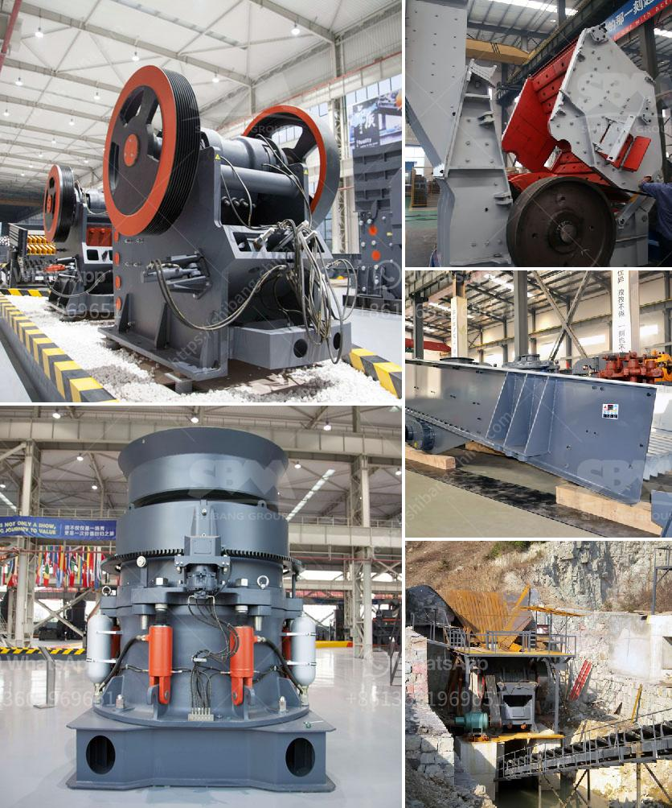

<h3>silver copper cone crusher</h3>
The silver copper cone crusher is a highly versatile machine that can be used in various crushing applications. It is designed to crush a variety of ore and rock types, ensuring superior performance and reliable operation.

The cone crusher is well known for its rugged construction and application versatility. With hydraulic adjustment and tramp relief systems, it is a modern and robust solution for mining and industrial applications. The cone crusher delivers consistent performance for even the most demanding tasks.

One of the key advantages of the silver copper cone crusher is its ability to crush materials efficiently. It features a large feed opening and a powerful crushing chamber that enable it to handle large volumes of material. This ensures high productivity and reduces the need for frequent maintenance and downtime.

Moreover, the cone crusher is equipped with a range of advanced features that enhance its performance. These include a hydraulic setting adjustment system that allows easy and precise control of the crusher settings, ensuring optimal production levels. It also features a tramp relief system that protects the crusher from excessive pressure, preventing damage and costly repairs.

In addition to its impressive performance, the silver copper cone crusher also offers exceptional durability. It is built to withstand the toughest conditions, providing reliable operation in the harshest environments. The crusher's rugged construction and high-quality materials make it a long-lasting solution that can stand up to heavy use and continuous operations.

Overall, the silver copper cone crusher is a reliable and efficient crushing solution for various applications. Its versatility, performance, and durability make it a valuable asset for any mining or industrial operation. Whether used in primary or secondary crushing, the cone crusher delivers consistent results, ensuring high productivity and reduced downtime.
<h3>Contact us</h3><ul><li><strong>Whatsapp:&nbsp;<a href="https://wa.me/8613661969651">+8613661969651</a></strong></li><li><a href="https://swt.shibang-china.com/?git&amp;zhl&amp;silver copper cone crusher"><strong>Online Service(chat now)</strong></a></li></ul><h3>Related</h3><ul><li><a href='enquiry about rock crusher.md'>enquiry about rock crusher</a></li><li><a href='the company mines limestone in ethiopia.md'>the company mines limestone in ethiopia</a></li><li><a href='gypsum plant equipment catalogue.md'>gypsum plant equipment catalogue</a></li><li><a href='crusher plant in rajasthan.md'>crusher plant in rajasthan</a></li><li><a href='small scale gold refinery plant equipments.md'>small scale gold refinery plant equipments</a></li></ul>