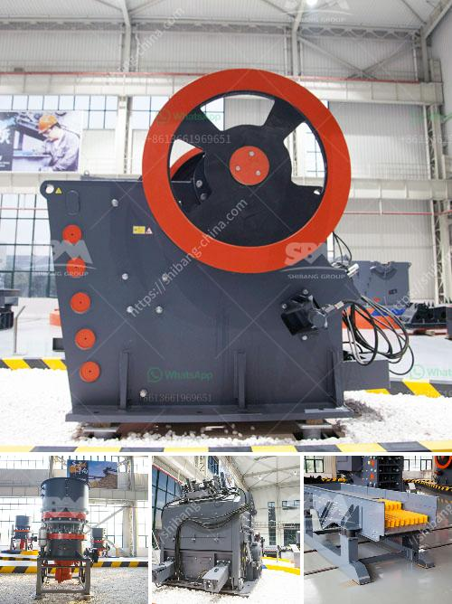

<h3>simple diagram for high energy ball milling</h3>
High energy ball milling is a widely used mechanical process in which materials are subjected to intense collisions and forces in order to achieve a desired particle size reduction. The process involves a high-speed, vibratory mill with a cylindrical container filled with balls and a sample mixture being subjected to high-energy impacts. To better understand this process, a simple diagram can be used to illustrate the main components and movements involved.

At the heart of a high energy ball milling process is a rotating cylindrical container, often referred to as the mill drum or barrel. This container is partially filled with spherical or cylindrical grinding media, such as steel or ceramic balls, which serve as the grinding medium. The grinding media and the sample mixture are added to the mill drum, and the rotation of the drum causes the grinding media to tumble and collide with the sample mixture.

The diagram would typically show the mill drum in a vertical or horizontal orientation, depending on the specific design of the high energy ball mill. From the diagram, it is evident that the mill drum consists of a cylindrical outer casing, which is usually made of metal, and a central axis that is either stationary or rotates along with the drum.

To further enhance the grinding process, some high energy ball mills feature an additional chamber or secondary container, known as the milling bead chamber. This chamber is located above or internally within the main mill drum and contains additional grinding media, typically in the form of smaller beads, which help to increase the energy transferred to the sample mixture and promote efficient particle size reduction.

The diagram should also depict the movement of the grinding media and sample mixture within the mill drum. As the drum rotates, the grinding media are lifted to a certain height and then free fall due to gravity, resulting in a cascading or cataracting motion. This movement generates intense impacts between the grinding media and the sample mixture, leading to the fragmentation and size reduction of the particles.

It is important to note that the diagram should include safety measures, such as protective casing and proper ventilation, to ensure the safe operation of the high energy ball milling process. Additionally, the diagram may also illustrate the presence of a cooling system, which is often employed to prevent excessive heat buildup during milling.

In conclusion, a simple diagram can effectively illustrate the main components and movements involved in high energy ball milling. By visualizing the process, researchers and operators can better understand and optimize this widely used technique for particle size reduction.
<h3>Contact us</h3><ul><li><strong>Whatsapp:&nbsp;<a href="https://wa.me/8613661969651">+8613661969651</a></strong></li><li><a href="https://swt.shibang-china.com/?git&amp;zhl&amp;simple diagram for high energy ball milling"><strong>Online Service(chat now)</strong></a></li></ul><h3>Related</h3><ul><li><a href='crushing plants business machinery and construction.md'>crushing plants business machinery and construction</a></li><li><a href='quarry crusher plant in malaysia.md'>quarry crusher plant in malaysia</a></li><li><a href='raymond roller mills in kolkata.md'>raymond roller mills in kolkata</a></li><li><a href='hydraulic conveyor belts.md'>hydraulic conveyor belts</a></li><li><a href='crusher price in philippines.md'>crusher price in philippines</a></li></ul>