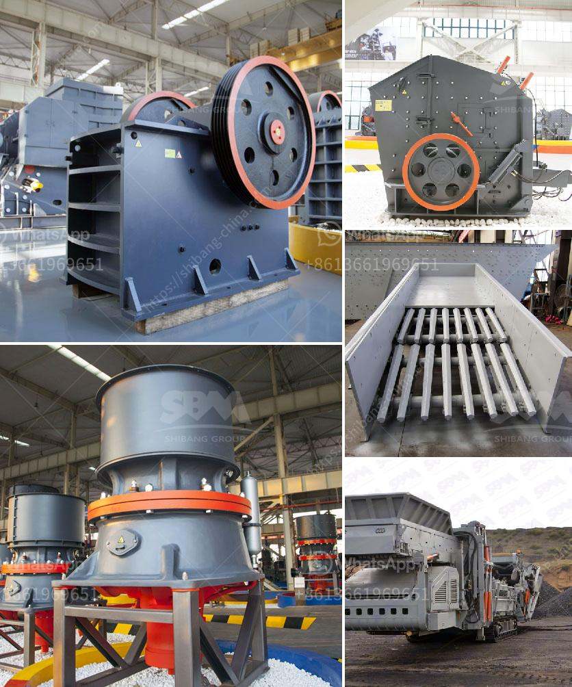

<h3>slag crusher makers in india</h3>
Slag, a by-product of steel production, is increasingly becoming a major concern among steelmakers in India. Not only does it occupy valuable space in storage yards, but its improper disposal also causes environmental issues. This has led to the rise in demand for slag crushers, which efficiently break down slag into smaller particles, enabling hassle-free disposal.

India, being a leading producer and consumer of steel, has fostered the growth of several slag crusher manufacturers in the country. These manufacturers have made their mark in the production of high-quality crushers. With their expertise and exceptional engineering abilities, they have produced top-notch crushers that are capable of efficiently reducing slag to fine particles.

The crushers manufactured by these makers are characterized by their durability, robustness, and high-performance capabilities. They undergo rigorous quality checks throughout the manufacturing process to ensure that they adhere to industry standards. Additionally, these crushers are specifically designed to handle different types of slag, ensuring optimum efficiency in the recycling process.

One notable slag crusher maker in India is Bhupindra Machines Pvt. Ltd. They offer a range of advanced crushers that are widely used in the steel industry. Their crushers are capable of handling various forms of slag, including blast furnace slag, steel slag, and Dross(slurry), among others. Apart from Bhupindra Machines Pvt. Ltd., there are several other reliable slag crusher makers in India, such as Jaikar Industrial Corporation, which has been serving the steel industry for over two decades.

The demand for slag crushers in India is expected to continue growing as steelmakers become more conscious of their environmental impact and seek efficient solutions for slag management. The collaboration between the steel industry and crusher manufacturers will play a vital role in the sustainable management of slag by transforming it into a valuable resource. With the technological advancements and expertise available, slag crusher makers in India are well-equipped to meet this increasing demand and contribute to a greener future.
<h3>Contact us</h3><ul><li><strong>Whatsapp:&nbsp;<a href="https://wa.me/8613661969651">+8613661969651</a></strong></li><li><a href="https://swt.shibang-china.com/?git&amp;zhl&amp;slag crusher makers in india"><strong>Online Service(chat now)</strong></a></li></ul><h3>Related</h3><ul><li><a href='how to start stone crusher project.md'>how to start stone crusher project</a></li><li><a href='crushed plant mobile coquimbo.md'>crushed plant mobile coquimbo</a></li><li><a href='complete crushing plant solutions prices.md'>complete crushing plant solutions prices</a></li><li><a href='raymond mills india.md'>raymond mills india</a></li><li><a href='mining process of calcium carbonate in south africa.md'>mining process of calcium carbonate in south africa</a></li></ul>