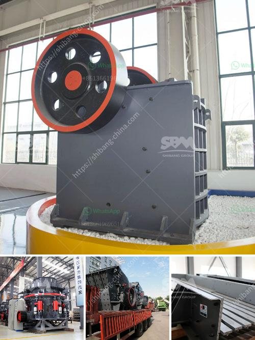

<h3>slag crushing machine manufacture in india</h3>
Slag, a by-product of steel production, is an essential component that aids in maintaining the quality of the final product. However, the process of manufacturing slag generates a significant amount of waste material, which needs to be disposed of effectively. This is where slag crushing machines come into play.

In India, where the steel industry is experiencing a rapid growth, the need for slag crushing machines is also significant. Apart from ensuring the safe disposal of waste slag, these machines also help in saving valuable resources like water and energy, which are otherwise consumed during the manufacturing process.

Slag crushing machines are designed with the utmost precision to ensure maximum efficiency and durability. They are manufactured using high-quality materials and advanced technology to meet the specific requirements of the industry. These machines are capable of crushing and screening slag, efficiently separating the metal and impurities, and recovering valuable components for further use.

Several manufacturers in India specialize in the production of slag crushing machines. These machines are highly versatile and can be used in various industries. Some of the popular manufacturers of slag crushing machines in India are Bhupindra Machines Pvt. Ltd, MGA Machinery, and Jaikar Industrial Corporation.

With the widespread use of slag crushing machines in India, the slag market is expected to grow significantly in the coming years. This growth can be attributed to the increasing demand for steel production, coupled with the need for sustainable waste management solutions.

In conclusion, the manufacture of slag crushing machines in India plays a crucial role in the steel industry. By efficiently crushing and separating waste slag, these machines not only contribute to the effective disposal of waste but also help in conserving valuable resources. With advancements in technology and a focus on sustainability, the future of slag crushing machines in India appears promising, as they continue to support the growth of the steel industry.
<h3>Contact us</h3><ul><li><strong>Whatsapp:&nbsp;<a href="https://wa.me/8613661969651">+8613661969651</a></strong></li><li><a href="https://swt.shibang-china.com/?git&amp;zhl&amp;slag crushing machine manufacture in india"><strong>Online Service(chat now)</strong></a></li></ul><h3>Related</h3><ul><li><a href='crusher manufacturing companies in india.md'>crusher manufacturing companies in india</a></li><li><a href='double toggle jaw crushers.md'>double toggle jaw crushers</a></li><li><a href='copper ore vertical ball mill.md'>copper ore vertical ball mill</a></li><li><a href='washing plant suppliers in mozambique.md'>washing plant suppliers in mozambique</a></li><li><a href='equipments in gypsum powder production line.md'>equipments in gypsum powder production line</a></li></ul>