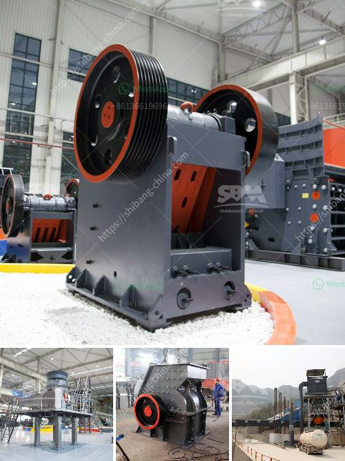

<h3>slag crushing plant manufacturers in india</h3>
Slag is a byproduct of the metal smelting process, which occurs when the metal being refined reacts with impurities in the raw materials used in the process. Slag can be used as a raw material in various industries to improve the overall quality and performance of the final product. One of the key industries where slag is utilized is in the construction sector, where it is used to produce cement, concrete, and other building materials.

To efficiently utilize slag, it needs to be crushed into smaller particles to facilitate its integration into various applications. This is where slag crushing plant manufacturers in India come into the picture. A slag crushing plant consists of a set of crushing machines that are used to crush and grind slag into useful particles or granules. These machines are designed as per the specific requirements of the industry and are manufactured with the highest quality materials to ensure reliability, durability, and efficiency.

India is a hub of industrial activity, with numerous manufacturing units and industries located across the country. As a result, the demand for slag crushing plants is quite high in India. Many companies in India have specialized in slag crushing plant manufacturing and offer slag crusher plants at competitive prices. They not only possess advanced technology to manufacture crushing machines, but also have a team of skilled professionals who are well-versed in designing customized solutions as per the specific requirements of the clients.

The slag crusher plants manufactured in India are typically equipped with a jaw crusher, cone crusher, impact crusher, gyratory crusher, and circular vibrating screen. These machines work in tandem with each other to efficiently process slag into smaller particles or granules. The crushed slag is then used in various applications such as cement production, road construction, fertilizer production, and more. The process of slag crushing involves multiple stages, including primary crushing, secondary crushing, and tertiary crushing, to achieve the desired particle size.

One of the key advantages of slag crushing plants is that they can process slag of varying compositions and sizes. This flexibility enables manufacturers to handle different types of slag and produce a wide range of output sizes to meet the diverse requirements of different industries. Furthermore, these plants are designed with safety features to minimize the risk of accidents and ensure the well-being of the operators.

Slag crushing plant manufacturers in India play a crucial role in the industry by providing high-quality and reliable crushing machines to process slag efficiently. These machines not only help in improving the overall quality of the final product but also reduce waste and ensure sustainable development. With the increasing demand for slag in various industries, the role of slag crushing plant manufacturers in India is expected to grow further in the coming years.
<h3>Contact us</h3><ul><li><strong>Whatsapp:&nbsp;<a href="https://wa.me/8613661969651">+8613661969651</a></strong></li><li><a href="https://swt.shibang-china.com/?git&amp;zhl&amp;slag crushing plant manufacturers in india"><strong>Online Service(chat now)</strong></a></li></ul><h3>Related</h3><ul><li><a href='concrete batching plant for sale.md'>concrete batching plant for sale</a></li><li><a href='ultra fine grinder mill.md'>ultra fine grinder mill</a></li><li><a href='greatwall jaw crusher.md'>greatwall jaw crusher</a></li><li><a href='for sale used mobile jaw crusher australia.md'>for sale used mobile jaw crusher australia</a></li><li><a href='stone crusher in himachal pradesh.md'>stone crusher in himachal pradesh</a></li></ul>