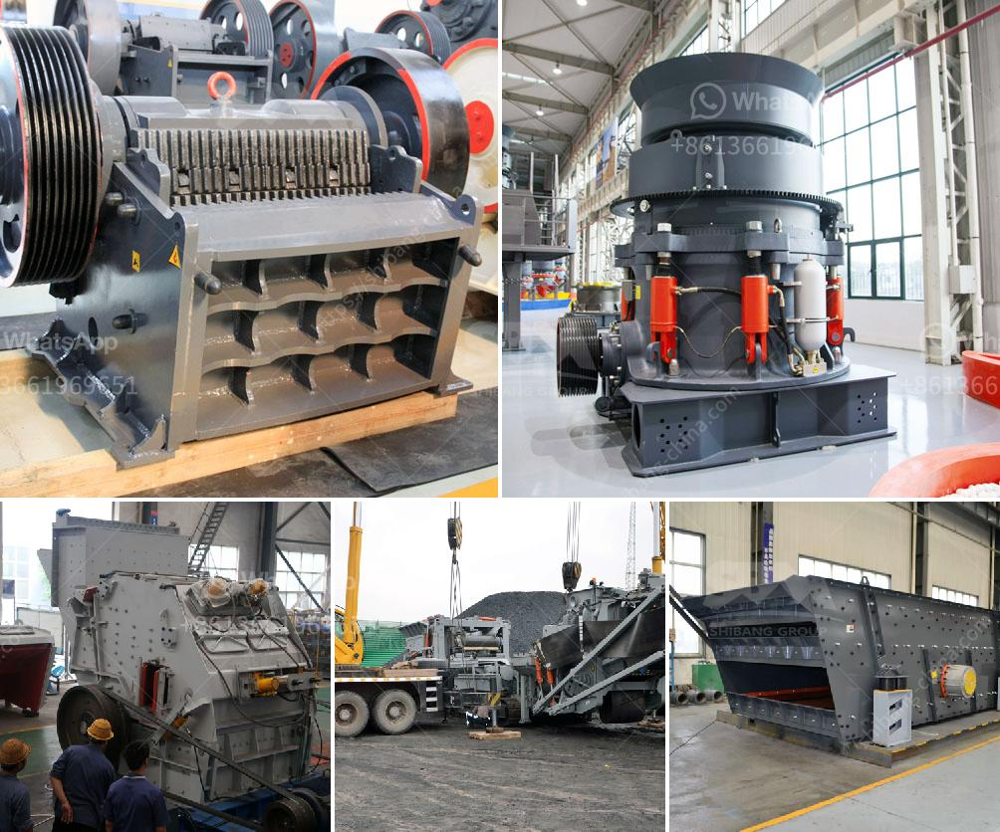

<h3>slag grinderr capling</h3>
The metal industry constantly seeks innovative technologies and techniques to enhance efficiency and sustainability. One such technology that has gained significant attention in recent years is the slag grinder capling process. This process offers numerous benefits, including better resource utilization, improved product quality, and reduced environmental impact.

In the metal production process, slag is a molten byproduct that forms during the smelting or refining of ores. Traditionally, the slag has been considered waste and discarded, leading to significant material and energy loss. However, with the advent of the slag grinder capling process, the waste slag is transformed into a valuable resource.

The slag grinder capling process involves grinding the slag into fine particles, which can then be used as raw material in various applications. This technique has proven to be both economically and environmentally beneficial. By efficiently recapturing and repurposing the slag, companies can reduce their reliance on raw materials while simultaneously minimizing waste generation.

One of the primary advantages of slag grinder capling is the improvement in resource utilization. By grinding the slag into fine particles, its reactive surface area significantly increases. This increased surface area allows for better reactivity with other materials, enabling it to substitute traditional raw materials in metallurgical processes. This, in turn, reduces the need for virgin materials, conserving natural resources and reducing overall production costs.

Furthermore, the use of recycled slag in the metal industry enhances product quality. Slag contains beneficial elements such as silicon, calcium, and iron, which are essential for several industrial applications. By incorporating recycled slag, companies can achieve a more consistent chemical composition in their products, resulting in improved strength, durability, and overall performance.

In addition to the economic benefits, slag grinder capling also contributes to environmental sustainability. Utilizing recycled slag reduces the demand for energy-intensive extraction and processing of raw materials. Additionally, it lowers greenhouse gas emissions associated with mining and manufacturing processes. By diverting waste from landfills and repurposing it, the process helps minimize the environmental footprint of the metal industry.

Moreover, the slag grinder capling process aligns with the principles of the circular economy. Rather than perpetuating the linear "take-make-dispose" model, this technique promotes a closed-loop system where waste is regarded as a valuable resource. By analyzing the entire lifecycle of materials, companies can maximize their resource efficiency, reduce waste generation, and contribute to a more sustainable future.

However, it is important to note that the successful implementation of slag grinder capling requires proper equipment and expertise. Specialized machinery, such as slag grinders and fine grinding mills, is necessary to achieve the desired particle size. Likewise, metallurgical knowledge is essential to optimize the incorporation of recycled slag into various industrial processes.

In conclusion, the slag grinder capling process offers numerous benefits for the metal industry. Through efficient utilization of waste slag, companies can reduce resource consumption, improve product quality, and minimize environmental impact. By embracing this innovative technology, the industry takes a significant step towards a more sustainable and efficient future.
<h3>Contact us</h3><ul><li><strong>Whatsapp:&nbsp;<a href="https://wa.me/8613661969651">+8613661969651</a></strong></li><li><a href="https://swt.shibang-china.com/?git&amp;zhl&amp;slag grinderr capling"><strong>Online Service(chat now)</strong></a></li></ul><h3>Related</h3><ul><li><a href='standard operating procedure of ball mill.md'>standard operating procedure of ball mill</a></li><li><a href='quartz mining equipments.md'>quartz mining equipments</a></li><li><a href='river pebble crusher supplier.md'>river pebble crusher supplier</a></li><li><a href='lm vertical mill.md'>lm vertical mill</a></li><li><a href='jaw crusher in german.md'>jaw crusher in german</a></li></ul>