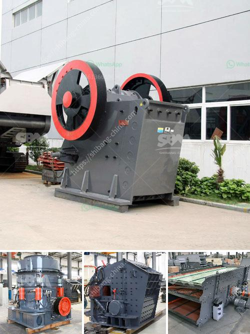

<h3>slag grinding machine in india</h3>
Slag is a byproduct of the steel-making process. It is formed when iron ore, limestone, and coke are heated together in a blast furnace. As the molten iron is extracted from the furnace, the slag is left behind and solidifies into a glass-like substance. This slag can then be processed further into a fine powder known as slag cement.

In India, the demand for steel products has been steadily increasing over the years, leading to a rise in steel production. With this increased production comes a significant amount of slag that needs to be managed effectively. This is where slag grinding machines come into play.

A slag grinding machine is a vital piece of equipment in the steelmaking industry. These machines grind down the slag into a fine powder-like substance, which is then used as a cement additive or raw material for various construction applications. The utilization of slag grinding machines in India has helped the country become one of the leading producers of slag cement.

One of the primary advantages of using slag cement is its environmental sustainability. By using slag as a substitute for traditional cement, the carbon footprint of the construction industry can be significantly reduced. Slag cement has a lower embodied carbon content compared to traditional cement due to its manufacturing process. This helps reduce greenhouse gas emissions, making it an eco-friendly choice.

Moreover, slag cement offers several performance benefits over traditional cement. Due to its chemical composition, slag cement has a higher resistance to chloride ingress, resulting in increased durability in concrete structures. It also possesses higher thermal and sound insulation properties, making it an ideal choice for applications like road construction, bridges, and buildings.

The demand for slag grinding machines in India has been on the rise due to the numerous benefits they offer. Manufacturers around the country have recognized this growing demand and have invested in developing and manufacturing cutting-edge slag grinding machines. These machines are designed to handle large volumes of slag efficiently and effectively, ensuring high-quality output.

Not only do slag grinding machines contribute to the steel industry's sustainability goals, but they also play a crucial role in meeting India's infrastructure development needs. As the country continues to invest in building its roads, bridges, and buildings, the demand for slag cement and the machines that produce it is only expected to increase.

In conclusion, slag grinding machines have become a vital part of the steelmaking industry in India. With their ability to process slag into fine powder, these machines offer several environmental and performance benefits. As the demand for steel and slag cement rises in the country, the utilization of slag grinding machines will continue to grow, cementing India's position as a leading producer of slag cement.
<h3>Contact us</h3><ul><li><strong>Whatsapp:&nbsp;<a href="https://wa.me/8613661969651">+8613661969651</a></strong></li><li><a href="https://swt.shibang-china.com/?git&amp;zhl&amp;slag grinding machine in india"><strong>Online Service(chat now)</strong></a></li></ul><h3>Related</h3><ul><li><a href='price of portable stonecrusher.md'>price of portable stonecrusher</a></li><li><a href='prices of coal pulverizers.md'>prices of coal pulverizers</a></li><li><a href='price of crusher.md'>price of crusher</a></li><li><a href='crusher manufacturing companies in india.md'>crusher manufacturing companies in india</a></li><li><a href='how much can a quarry plant cost.md'>how much can a quarry plant cost</a></li></ul>