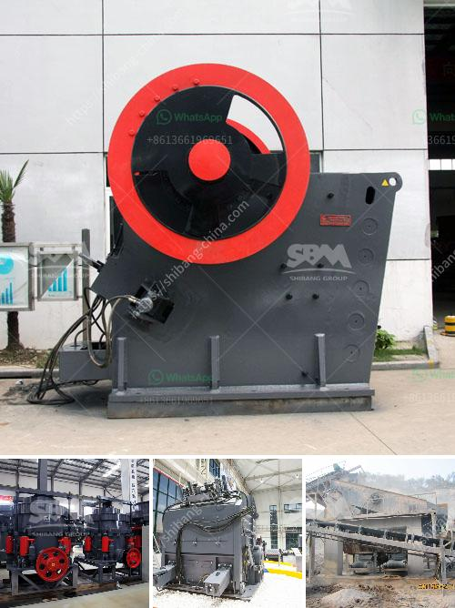

<h3>slag grinding plant</h3>
Slag grinding plant, or slag grinding mill, is the process of converting slags into fine powder using grinding machines. It is a term that refers to the complex process of grinding the primary and secondary components of slag particles. It involves a series of physical and chemical reactions that take place within the slag particles, leading to their de-agglomeration and size reduction.

Slag, a byproduct of various industrial processes such as steel manufacturing, is typically disposed of as waste. However, it possesses latent hydraulic properties that make it suitable as a supplementary cementitious material in the production of high-performance concrete. By utilizing a slag grinding plant, the slag can be processed and transformed into a valuable resource.

The grinding plant is usually installed at the cement or concrete production site. It operates independently or in conjunction with a clinker grinding plant. The plant requires a certain amount of land area and investment, but it offers several benefits. First and foremost, the utilization of slag in cement production reduces the need for traditional raw materials, such as limestone and clay. This results in a lower carbon footprint and a more sustainable production process.

Furthermore, the incorporation of slag in cement enhances its durability and mechanical properties. The fine particles produced during the grinding process provide nucleation sites for hydration reactions, leading to the formation of additional cementitious compounds. This improves the strength, resistance to chemical attack, and long-term performance of the resulting concrete.

In conclusion, a slag grinding plant is an essential infrastructure for the cement and concrete industry. It not only offers a sustainable waste management solution but also enhances the performance and durability of concrete structures. As more and more countries prioritize sustainable development, the demand for slag grinding plants is expected to rise.
<h3>Contact us</h3><ul><li><strong>Whatsapp:&nbsp;<a href="https://wa.me/8613661969651">+8613661969651</a></strong></li><li><a href="https://swt.shibang-china.com/?git&amp;zhl&amp;slag grinding plant"><strong>Online Service(chat now)</strong></a></li></ul><h3>Related</h3><ul><li><a href='gyratory crusher harga.md'>gyratory crusher harga</a></li><li><a href='concrete stone crusher south africa.md'>concrete stone crusher south africa</a></li><li><a href='ball mill for sand and gravel.md'>ball mill for sand and gravel</a></li><li><a href='screening and wash plant manufacturers in south africa.md'>screening and wash plant manufacturers in south africa</a></li><li><a href='germany calcium carbonate grinding mill suppliers.md'>germany calcium carbonate grinding mill suppliers</a></li></ul>