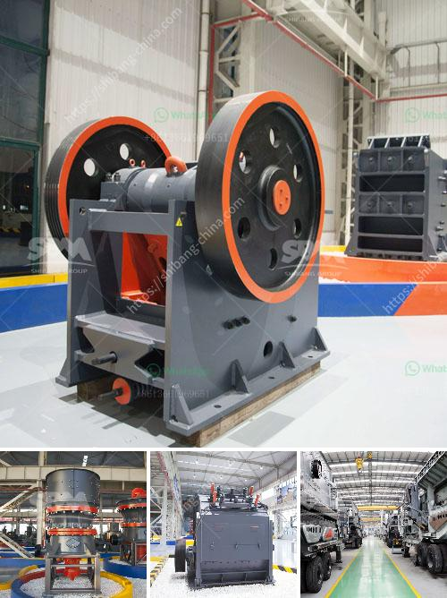

<h3>slag jaw crusher long size</h3>
Slag, also known as blast furnace water slag, is a byproduct of steel production. Its main components are calcium oxide, silicon dioxide, iron oxide, and a small amount of alumina and magnesia. Slag is one of the industrial solid wastes with large output and wide application. At present, the comprehensive utilization rate of slag is only about 10%, so there is great potential for development. Jaw crusher, as a high-efficiency crushing equipment with long service life, is widely used in various industries such as mining, building materials, and metallurgy.

The slag jaw crusher is a key machine used to process steel slag, and is widely used in industries such as mining, metallurgy, building materials, and road construction. As an integral equipment in the whole production line, its efficiency is directly related to the comprehensive utilization of slag resources. In order to improve the crushing efficiency and reduce the wear of the jaw crusher, various measures have been taken in the design and production process.

Firstly, the structure of the slag jaw crusher has been optimized. Its frame is mainly composed of two side plates, a front and rear wall, a movable jaw, a fixed jaw, an eccentric shaft, a bearing, a hydraulic system, and an electrical system. The structure is simple and compact, which reduces the size and weight of the equipment, and improves the processing capacity. In addition, the crusher adopts a wedge adjustment device, which can adjust the size of the discharge opening according to the needs of the user, thereby ensuring the particle size of the finished product.

Secondly, the materials used in the production of the slag jaw crusher are carefully selected. The main body of the crusher is made of high-quality steel plates, which have good wear resistance and impact resistance. The movable jaw is made of high-quality cast iron, which is durable and has a long service life. The fixed jaw is equipped with a wear-resistant lining plate, which can effectively extend the service life of the jaw crusher.

Thirdly, the slag jaw crusher is equipped with a hydraulic discharge opening adjustment device, which can easily adjust the size of the discharge opening, thereby controlling the particle size of the finished product. At the same time, it can also automatically discharge the unbreakable materials, preventing the equipment from being damaged by oversized materials and improving the efficiency of crushing.

Finally, the slag jaw crusher is equipped with a centralized lubrication system, which can effectively reduce the friction between the various components, reduce the wear and tear of the equipment, and extend the service life. In addition, the electrical system of the crusher is also equipped with overload protection, which can protect the equipment in case of overload and ensure the safety of operation.

In summary, the slag jaw crusher has the characteristics of high efficiency, low energy consumption, reliable operation, and easy maintenance. It is an ideal crushing equipment for crushing steel slag. With the continuous improvement of technology, the performance of jaw crushers will continue to improve, and the utilization rate of slag resources will also be further improved.
<h3>Contact us</h3><ul><li><strong>Whatsapp:&nbsp;<a href="https://wa.me/8613661969651">+8613661969651</a></strong></li><li><a href="https://swt.shibang-china.com/?git&amp;zhl&amp;slag jaw crusher long size"><strong>Online Service(chat now)</strong></a></li></ul><h3>Related</h3><ul><li><a href='price of portable stonecrusher.md'>price of portable stonecrusher</a></li><li><a href='sand making machine from china.md'>sand making machine from china</a></li><li><a href='coal mill pulverizer.md'>coal mill pulverizer</a></li><li><a href='portable ballast crusher for sale.md'>portable ballast crusher for sale</a></li><li><a href='usine carbonate de calcium.md'>usine carbonate de calcium</a></li></ul>