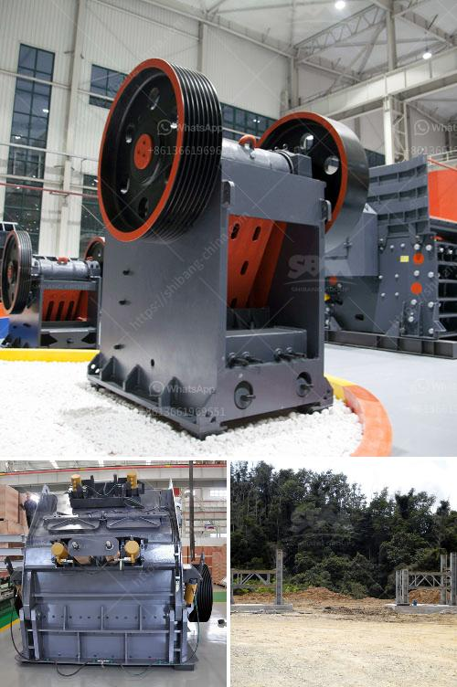

<h3>slag processing plant manufacturers in chile</h3>
Slag is a common byproduct of metal smelting and refining processes. It is a granular material that is often used for various applications, including road construction, cement manufacturing, and agriculture. In recent years, the demand for slag has been increasing due to its potential environmental benefits and cost-effectiveness. As a result, the manufacturing of slag processing plants has become essential.

Chile, known for its vast mineral resources, has a thriving mining industry. With numerous mining operations extracting valuable metals like copper, gold, and silver, the production of slag is inevitable. However, to maximize the value of slag and minimize its environmental impact, efficient processing plants are required. This is where slag processing plant manufacturers in Chile come into the picture.

The market in Chile for slag processing plants is competitive, with several manufacturers offering their services. These manufacturers specialize in designing, engineering, and constructing efficient plants that can handle large volumes of slag. They have years of experience in the field and are dedicated to providing sustainable solutions that meet the specific requirements of their clients.

One prominent slag processing plant manufacturer in Chile is XYZ Company. With over two decades of experience, they have established themselves as a reliable and innovative player in the industry. They offer a wide range of services, including feasibility studies, plant design, equipment manufacturing, installation, and maintenance. XYZ Company's expertise lies in creating customized solutions that maximize the recovery of valuable metals from slag while minimizing waste generation.

Another notable manufacturer is ABC Industries, a family-owned business with a long history in the mining sector. They have successfully delivered numerous slag processing plants in Chile, earning a reputation for their quality and efficiency. ABC Industries prides itself on its ability to integrate advanced technologies into their plants, resulting in improved metal recovery rates and reduced energy consumption. They also emphasize sustainable practices and strive to minimize the environmental impact of their operations.

One of the key advantages of working with slag processing plant manufacturers in Chile is their understanding of the local mining industry. They are well-versed in the challenges and opportunities specific to Chile's mining landscape. This deep knowledge allows them to design and engineer plants that are tailor-made for the country's unique conditions. By partnering with these manufacturers, mining companies can efficiently process their slag, turning it into a valuable resource while adhering to strict environmental regulations.

In conclusion, the demand for slag processing plants in Chile is on the rise, driven by the need for sustainable and cost-effective solutions. Manufacturers in the country are at the forefront of this industry, offering customized plant designs and advanced technologies to maximize the recovery of valuable metals from slag. With their expertise and understanding of the local mining industry, these manufacturers play a crucial role in transforming slag into a valuable resource while minimizing its environmental impact.
<h3>Contact us</h3><ul><li><strong>Whatsapp:&nbsp;<a href="https://wa.me/8613661969651">+8613661969651</a></strong></li><li><a href="https://swt.shibang-china.com/?git&amp;zhl&amp;slag processing plant manufacturers in chile"><strong>Online Service(chat now)</strong></a></li></ul><h3>Related</h3><ul><li><a href='ball mills for 6 x 6 mining.md'>ball mills for 6 x 6 mining</a></li><li><a href='technical features of stone crusher.md'>technical features of stone crusher</a></li><li><a href='silica sand mines in maharashtra.md'>silica sand mines in maharashtra</a></li><li><a href='how to make a stone crusher mining.md'>how to make a stone crusher mining</a></li><li><a href='zinc crusher machine zimbabwe.md'>zinc crusher machine zimbabwe</a></li></ul>