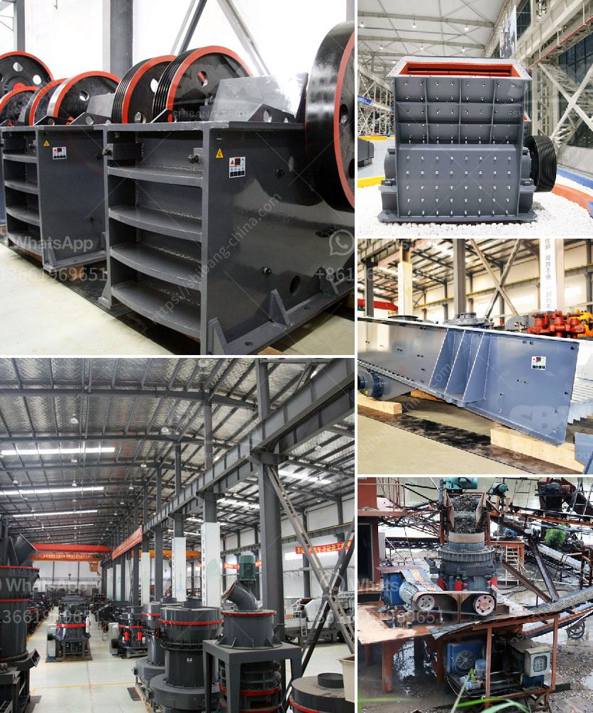

<h3>small ball mill for sale</h3>
Small ball mill is also called mini ball mill, which is mainly used in cement, silicate products, building materials, refractory materials, chemical fertilizer, black and non-ferrous metal processing and glass ceramics industry. Compared to the large-scale ball mill, the price of a small ball mill is more economical and the performance is also not inferior.

1. Cost-Effective: A small ball mill can save you a significant amount of money. It is more affordable than a large-scale ball mill and enables you to save on installation costs as well.

2. Versatile: Small ball mills can be used for a wide range of applications. They are suitable for grinding and blending materials in both wet and dry conditions.

3. Compact Design: Small ball mills are designed to be compact and portable, making them easy to transport and store. They do not require a large space for installation and can be placed on a sturdy workbench or table.

4. Low Energy Consumption: Small ball mills consume less energy compared to large-scale ball mills. This makes them more energy-efficient and reduces your overall energy costs.

5. Easy Operation and Maintenance: Small ball mills are user-friendly and require minimal maintenance. The operating procedures are straightforward, and the maintenance tasks are simple and easy to perform.

1. Size and Capacity: Determine the size and capacity of the ball mill based on the amount of material you need to process. Small ball mills are available in various sizes, ranging from laboratory scale to mini ball mill models.

2. Material and Durability: Consider the material used for the construction of the ball mill. Opt for high-quality materials such as stainless steel or ceramic, as they offer better durability and longevity.

3. Motor Power: Choose a small ball mill with an appropriate motor power to suit your needs. Ensure that the motor can handle the load and operate efficiently for extended periods.

4. Safety Features: Look for safety features such as a safety switch, protective guards, and emergency stop buttons to prevent accidents and injuries.

5. Cost: Compare prices from multiple suppliers to ensure you are getting the best deal. Consider the overall value for money, including the quality, performance, and features of the small ball mill.

In conclusion, a small ball mill is an excellent investment for laboratories, small-scale manufacturers, and hobbyists. It offers numerous advantages, including cost-effectiveness, versatility, compact design, low energy consumption, and easy operation. When purchasing a small ball mill, consider factors such as size, capacity, material, motor power, safety features, and cost. With proper care and maintenance, a small ball mill can serve you well for a long time, helping you achieve efficient grinding and processing of various materials.
<h3>Contact us</h3><ul><li><strong>Whatsapp:&nbsp;<a href="https://wa.me/8613661969651">+8613661969651</a></strong></li><li><a href="https://swt.shibang-china.com/?git&amp;zhl&amp;small ball mill for sale"><strong>Online Service(chat now)</strong></a></li></ul><h3>Related</h3><ul><li><a href='impact crusher supplier.md'>impact crusher supplier</a></li><li><a href='gyratory crusher copper mine.md'>gyratory crusher copper mine</a></li><li><a href='granite quarry plants for sale.md'>granite quarry plants for sale</a></li><li><a href='silica quartz powder processing.md'>silica quartz powder processing</a></li><li><a href='stone crusher in malaysia.md'>stone crusher in malaysia</a></li></ul>