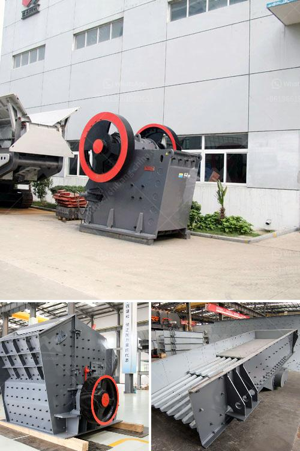

<h3>small crushers for sale</h3>
Small crushers for sale are essential equipment in mining, metallurgy, building materials, and other industries. They crush solid materials into smaller pieces, making it easier for disposal or further processing. Small crushers are ideal for small-scale and intermittent projects, which is common in rural areas and small towns.

Some businesses may lack the capital to purchase larger crushers for a full-time operation. However, small crushers are versatile enough to handle smaller-scale construction projects. They are especially useful for homeowners or small construction companies looking to reduce transportation costs, increase efficiency, and save time.

One of the primary advantages of small crushers is their portability. These machines can follow dismantled structures to the site where the waste material is generated, reducing the need for transportation. Small crushers can fit into tight spaces, making them suitable for both indoor and outdoor use. They can be easily moved from one location to another, allowing for maximum versatility and convenience.

Despite their small size, these crushers are powerful enough to crush various materials. They are commonly used to crush concrete, bricks, asphalt, rock, and natural stones. With the right attachments, small crushers can also be used for processing wooden planks and other types of construction waste.

The usage of small crushers eliminates the need to transport materials to a centralized crushing facility, which can be expensive and time-consuming. Instead, these machines can be operated directly on-site, reducing transportation costs and ensuring that the material is crushed at its source. This not only saves money but also reduces environmental impact by minimizing carbon emissions.

In addition to their portability and versatility, small crushers are also efficient. They are designed to save time and labor by automating the crushing process, thereby increasing productivity. Small crushers require minimal maintenance and are easy to operate, making them suitable for users with limited technical expertise.

Furthermore, small crushers for sale are cost-effective. They are relatively affordable compared to larger crushers, making them accessible to small businesses with tight budgets. By investing in a small crusher, businesses can save on disposal fees and generate additional revenue by selling crushed materials.

When choosing a small crusher, it is important to consider factors such as the crushing capacity, power consumption, maximum feed size, and ease of maintenance. It is recommended to consult with professionals or suppliers who can provide guidance based on specific requirements and site conditions.

In conclusion, small crushers for sale are valuable assets for businesses and individuals alike. They offer portability, versatility, efficiency, and cost-effectiveness, making them the perfect solution for small-scale construction projects. Investing in a small crusher can help businesses reduce transportation costs, increase productivity, and generate additional revenue from crushed materials.
<h3>Contact us</h3><ul><li><strong>Whatsapp:&nbsp;<a href="https://wa.me/8613661969651">+8613661969651</a></strong></li><li><a href="https://swt.shibang-china.com/?git&amp;zhl&amp;small crushers for sale"><strong>Online Service(chat now)</strong></a></li></ul><h3>Related</h3><ul><li><a href='stone crusher machine company in usa.md'>stone crusher machine company in usa</a></li><li><a href='production process of cement.md'>production process of cement</a></li><li><a href='price of portable stonecrusher.md'>price of portable stonecrusher</a></li><li><a href='crushers and wash plant processes.md'>crushers and wash plant processes</a></li><li><a href='puzzolana tph cone crusher plant prices.md'>puzzolana tph cone crusher plant prices</a></li></ul>