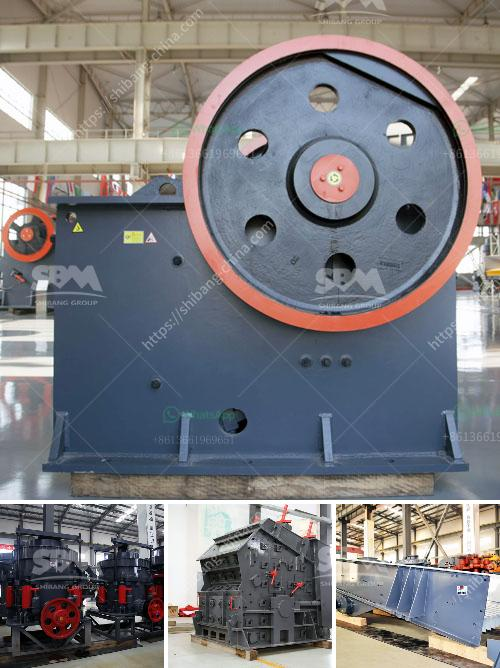

<h3>small crushing machines for gold</h3>
Gold is a precious metal that holds immense value. Its rarity and high demand make it a lucrative investment option, with many individuals and companies seeking ways to extract gold from ore. One essential tool in this process is a crushing machine. These machines break down large rocks and ores into smaller, more manageable pieces, facilitating further gold extraction.

When it comes to crushing gold-bearing rocks, small crushing machines are the ideal choice. These machines are cost-effective, efficient, and highly capable of breaking down even the toughest ores. Their compact size makes them portable and easy to transport to mining sites, enhancing their usability and versatility.

Small crushing machines for gold typically operate using various mechanisms, such as jaw crushers, impact crushers, or cone crushers. Jaw crushers, commonly used in mining operations, operate by squeezing rock between two plates that crush the material into smaller pieces. Impact crushers, on the other hand, use a different mechanism: rocks are fed into a chamber and are struck by rapidly rotating hammers. This impact breaks down the material into fine particles. Cone crushers are also popular, working similarly to jaw crushers but with the added advantage of a rotating cone-shaped crushing head.

One key advantage of small crushing machines is their affordability. Compared to larger crushing machines, small crushers are much more budget-friendly, making them accessible to a wider range of users. Additionally, their lower energy consumption contributes to cost savings. Small crushing machines are also commonly available in the used market, allowing buyers to save even more money without compromising on quality.

In conclusion, small crushing machines for gold are crucial tools in the gold extraction process. Their efficient and affordable nature makes them ideal for individuals and small-scale mining operations. Whether it's jaw crushers, impact crushers, or cone crushers, these machines offer effective solutions in breaking down rocks and ores, enabling efficient gold extraction. By utilizing these machines, gold prospectors and mining companies can increase their productivity and maximize their returns on investment.
<h3>Contact us</h3><ul><li><strong>Whatsapp:&nbsp;<a href="https://wa.me/8613661969651">+8613661969651</a></strong></li><li><a href="https://swt.shibang-china.com/?git&amp;zhl&amp;small crushing machines for gold"><strong>Online Service(chat now)</strong></a></li></ul><h3>Related</h3><ul><li><a href='conveyor belt distributor in nigeria.md'>conveyor belt distributor in nigeria</a></li><li><a href='calcium carbonate powder machine.md'>calcium carbonate powder machine</a></li><li><a href='how to make a mineral crushing machine.md'>how to make a mineral crushing machine</a></li><li><a href='powder production line price.md'>powder production line price</a></li><li><a href='stone crusher machine sale in zambia.md'>stone crusher machine sale in zambia</a></li></ul>