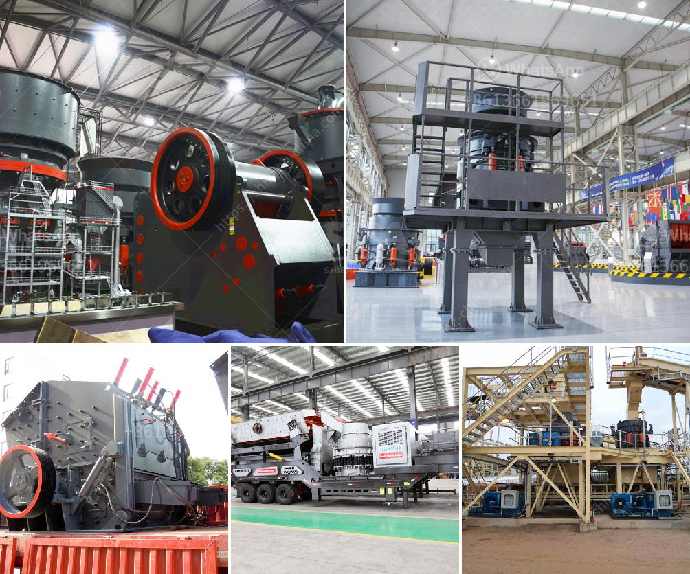

<h3>small ore crusher</h3>
In the world of mining, extracting valuable minerals from their respective ores is crucial for various industries. However, the process of extracting these minerals can be challenging and time-consuming, particularly if you lack the necessary equipment. That is where a small ore crusher comes in handy. With its compact size and efficient functionality, it enables miners to break down large chunks of ore into smaller, more manageable pieces.

A small ore crusher, also known as a mini crusher, is specifically designed to reduce large rocks/granules into smaller rocks/granules or dust. This equipment is commonly used in both mining and construction industries, as well as recycling applications, to reduce waste materials and facilitate easier disposal. The main purpose of a small ore crusher is to quickly and efficiently crush the materials to a specific size, ensuring optimal processing and separation.

One of the key advantages of a small ore crusher is its size. As the name suggests, it is compact and lightweight, making it easy to transport and set up in different locations. This versatility is particularly beneficial for mining operations in remote areas, where setting up a large crushing plant may not be feasible. With a small ore crusher, miners can easily move from one site to another, allowing for greater exploration and exploitation of mining resources.

Despite its smaller size, a small ore crusher is not lacking in power. These machines are equipped with robust motors and crushing mechanisms designed to handle various types of ores, regardless of their hardness or abrasiveness. Consequently, they can efficiently crush a wide range of materials, including minerals like gold, silver, copper, iron, and even non-metallic ores. Furthermore, modern small ore crushers are equipped with adjustable settings, allowing for precise control over the final particle size produced.

Another benefit of using a small ore crusher is its cost-effectiveness. Compared to larger crushers, a small ore crusher requires less initial investment, operation, and maintenance costs. This makes it an attractive option for small-scale miners or mining companies with a limited budget. Additionally, a small ore crusher typically has a lower energy consumption, contributing to reduced operating expenses. Such financial advantages enable miners to maximize their profits while still obtaining the desired crushed ore size.

In conclusion, a small ore crusher is an indispensable tool for any mining operation. Its compact size, efficient functionality, and cost-effectiveness make it an ideal choice for extracting valuable minerals from ores. Whether it's used in mining, construction, or recycling activities, a small ore crusher enables miners to break down large rocks/granules into smaller, more manageable pieces. With its powerful motor and adjustable settings, it can handle various types of ores, ensuring optimal processing and separation. So, if you're a miner looking to enhance your productivity and profitability, consider investing in a small ore crusher – the key to crushing made easy!
<h3>Contact us</h3><ul><li><strong>Whatsapp:&nbsp;<a href="https://wa.me/8613661969651">+8613661969651</a></strong></li><li><a href="https://swt.shibang-china.com/?git&amp;zhl&amp;small ore crusher"><strong>Online Service(chat now)</strong></a></li></ul><h3>Related</h3><ul><li><a href='graphite beneficiation process.md'>graphite beneficiation process</a></li><li><a href='sand quarry plant.md'>sand quarry plant</a></li><li><a href='stones crushing machine in south africa for sale.md'>stones crushing machine in south africa for sale</a></li><li><a href='used sand screen in south africa sale.md'>used sand screen in south africa sale</a></li><li><a href='stone crusher plant manufacturers china.md'>stone crusher plant manufacturers china</a></li></ul>