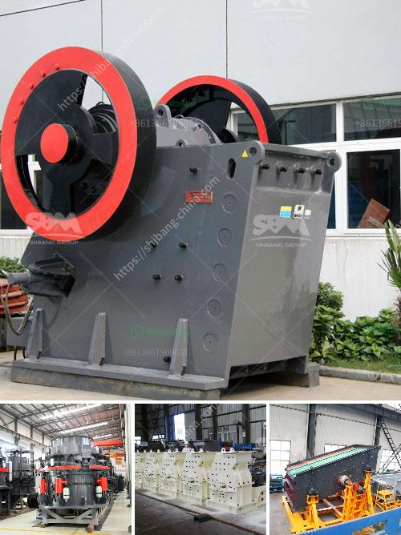

<h3>small rotary burner for sale used in us</h3>
When it comes to heating systems, finding the perfect balance between efficiency, versatility, and affordability is crucial. Whether you are a homeowner, business owner, or contractor in the United States, investing in a small rotary burner can provide exceptional heating performance and a wide range of applications. Let's explore the benefits of these burners and why they are becoming increasingly popular in the market.

In the US, small rotary burners are gaining recognition as reliable solutions for various heating needs. These compact burners are specifically designed to optimize thermal efficiency and provide consistent heat output, making them highly beneficial for both residential and commercial usage. With their versatility and ease of installation, they have become a go-to choice for many heating professionals.

One of the key advantages of small rotary burners is their high fuel efficiency. These burners are engineered to maximize heat generation while minimizing energy consumption, resulting in significant cost savings. By using advanced combustion technology, they convert fuel into heat in the most efficient manner possible, ensuring every ounce of energy is utilized effectively. The fuel consumption of small rotary burners is thus minimized, making them an excellent choice for those seeking an eco-friendly heating solution.

Moreover, small rotary burners offer great versatility in terms of their applications. Whether you require heating for a small residential space, a workshop, warehouse, or even an industrial facility, these burners can easily adapt to meet different requirements. With adjustable temperature and air flow settings, they provide precise control over the heating process, allowing you to create a comfortable environment tailored to your needs.

In addition to their efficiency and versatility, small rotary burners are highly durable and require minimal maintenance. Made from high-quality materials, these burners are designed to withstand the demands of continuous operation without compromising on performance. Furthermore, they are equipped with safety features that prevent malfunctions and ensure the well-being of users.

When searching for small rotary burners for sale in the US, it is important to consider reputable sellers who offer reliable products and excellent customer support. The market offers a wide array of brands and models to choose from. It is advisable to evaluate the reputation, certifications, and reviews of potential suppliers to ensure you are purchasing a high-quality burner that meets your specific requirements.

In conclusion, small rotary burners are an exceptional choice for heating needs in the US. Their remarkable fuel efficiency, versatility, and durability make them a sound investment for both individual and commercial users alike. By providing efficient heat output and a wide range of applications, these burners ensure optimal comfort while keeping energy costs in check. Whether you are looking to upgrade your existing heating system or seeking a new solution, consider investing in a small rotary burner and experience the benefits it offers.
<h3>Contact us</h3><ul><li><strong>Whatsapp:&nbsp;<a href="https://wa.me/8613661969651">+8613661969651</a></strong></li><li><a href="https://swt.shibang-china.com/?git&amp;zhl&amp;small rotary burner for sale used in us"><strong>Online Service(chat now)</strong></a></li></ul><h3>Related</h3><ul><li><a href='how to build a garnet wash plant.md'>how to build a garnet wash plant</a></li><li><a href='sell of used dolomite roller mill in india.md'>sell of used dolomite roller mill in india</a></li><li><a href='hammer crusher catalog pdf.md'>hammer crusher catalog pdf</a></li><li><a href='difference between hp cone crusher.md'>difference between hp cone crusher</a></li><li><a href='list of stone crushers in odisha.md'>list of stone crushers in odisha</a></li></ul>