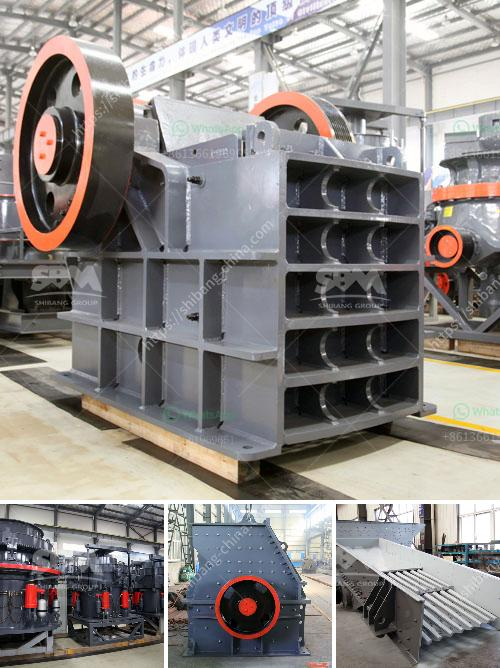

<h3>small scale gold processing machines price list</h3>
Small-scale gold processing machines are often used in artisanal and small-scale mining operations to extract and process gold. They offer a cost-effective alternative to industrial-scale processing plants for smaller mining operations. They are also portable and can be easily moved, giving mining companies flexibility in where they set up their operations. In recent years, the demand for these machines has increased, leading to a rise in the number of manufacturers producing them.

The price of small-scale gold processing machines varies based on the brand, quality, and capacity. However, it is generally affordable, making it accessible to small-scale miners. Prices can range from a few thousand dollars up to tens of thousands of dollars. Some manufacturers even offer financing options to help miners acquire these machines.

Purchasing a small-scale gold processing machine is a significant investment for small-scale miners. However, it is a worthwhile investment as it allows them to process gold ore efficiently and improve their mining operations. These machines use various mechanisms like crushing, grinding, and gravity separation to extract gold from the ore. They are designed to handle different types of ore and can be customized to suit specific mining conditions.

It is important for miners to research and compare prices and features before making a purchase. Many manufacturers provide price lists on their websites, allowing miners to compare different models and options. It is also beneficial to consult with experts or other miners who have experience with these machines to get recommendations and advice.

In conclusion, small-scale gold processing machines are essential tools for artisanal and small-scale miners. Their affordable prices and portability make them accessible to miners with limited resources. It is crucial for miners to research and compare prices before investing in these machines to ensure they get the best value for their money.
<h3>Contact us</h3><ul><li><strong>Whatsapp:&nbsp;<a href="https://wa.me/8613661969651">+8613661969651</a></strong></li><li><a href="https://swt.shibang-china.com/?git&amp;zhl&amp;small scale gold processing machines price list"><strong>Online Service(chat now)</strong></a></li></ul><h3>Related</h3><ul><li><a href='granite quarry plants for sale.md'>granite quarry plants for sale</a></li><li><a href='dry grinders mills.md'>dry grinders mills</a></li><li><a href='germany rocks crushers.md'>germany rocks crushers</a></li><li><a href='silica quartz crushing plant.md'>silica quartz crushing plant</a></li><li><a href='mobile coal washing plant investment.md'>mobile coal washing plant investment</a></li></ul>