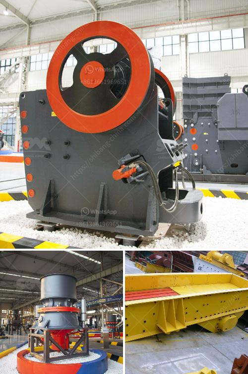

<h3>small scale mining equipment in nigeria</h3>
Small scale mining in Nigeria is one of the most thriving sectors of the country’s economy. As a result, the demand for small scale mining equipment is skyrocketing. Smallscale mining is an integral part of mining in Nigeria, which can contribute to local and regional development.

Mining is a complex process that requires heavy machinery to extract mineral resources from the earth. These resources include precious metals, gemstones, industrial minerals, and construction materials. Unlike large scale mining, small scale mining involves manual labor and rudimentary tools, making it a labor-intensive and artisanal activity.

In Nigeria, small scale miners lack access to modern mining equipment which is crucial for their operations. These equipment help in increasing efficiency, reducing waste, improving safety, and ultimately, optimizing their profits. However, despite the demand for small scale mining equipment, the supply is limited and often inaccessible to most miners.

To address this challenge, the government and private sector stakeholders should invest in the development and provision of small scale mining equipment. This would ensure that small scale miners have access to the necessary tools to maximize productivity and contribute to the overall growth of the mining sector.

Furthermore, there is a need for capacity building and skill development in the small scale mining sector. Training programs on the proper use and maintenance of mining equipment should be provided to miners, empowering them with the knowledge and skills necessary to operate machinery safely and efficiently.

At the same time, it is crucial to focus on sustainable mining practices to minimize the negative impact on the environment. Small scale miners should be educated on responsible mining, proper waste disposal, and the use of eco-friendly technologies that reduce pollution and prevent resource depletion.

In conclusion, the demand for small scale mining equipment in Nigeria is high, and efforts should be made to ensure its availability to miners. By investing in the development of modern equipment, providing training and capacity building, and promoting sustainable mining practices, the small scale mining sector can thrive, contributing to economic development and poverty reduction in Nigeria.
<h3>Contact us</h3><ul><li><strong>Whatsapp:&nbsp;<a href="https://wa.me/8613661969651">+8613661969651</a></strong></li><li><a href="https://swt.shibang-china.com/?git&amp;zhl&amp;small scale mining equipment in nigeria"><strong>Online Service(chat now)</strong></a></li></ul><h3>Related</h3><ul><li><a href='roller mill manufacturers in nigeria.md'>roller mill manufacturers in nigeria</a></li><li><a href='stone dust processing machine.md'>stone dust processing machine</a></li><li><a href='limestone crusher manufacturers price.md'>limestone crusher manufacturers price</a></li><li><a href='rubber conveyor belt manufacturers in turkey.md'>rubber conveyor belt manufacturers in turkey</a></li><li><a href='silica sand mines in maharashtra.md'>silica sand mines in maharashtra</a></li></ul>