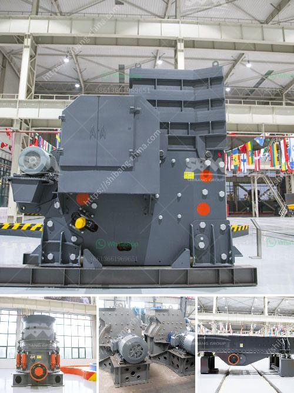

<h3>small scale mining project proposal</h3>
Mining plays a vital role in the economic growth and development of many nations worldwide. However, the sector is often dominated by large-scale mining operations that require substantial capital investment, advanced technology, and extensive infrastructure. In contrast, small scale mining offers a more localized and sustainable approach to mining, which can positively impact local economies. This proposal aims to outline a small scale mining project that can contribute to the socio-economic development of a local community.

The objective of this project is to establish a small-scale mining operation  that complies with environmental regulations, advances responsible mining practices, and ensures a fair distribution of benefits to the local community. By adopting sustainable and inclusive practices, the project aims to enhance the economic growth and social well-being of the community while preserving the environment.

1. Location and Resources: Identify a suitable location for the mining project, ideally an area with untapped mineral deposits. Conduct a thorough geological survey to assess the resource potential, ensuring that the proposed mining activities can be carried out safely and sustainably.

2. Environmental Impact Assessment (EIA): Conduct a comprehensive EIA to assess potential environmental impacts, such as soil erosion, water pollution, and habitat destruction. Implement necessary measures to mitigate negative impacts, including land rehabilitation and reforestation plans.

3. Community Engagement: Collaborate with local communities, stakeholders, and relevant authorities to build trust, gain support, and address any concerns or conflicts. Establish community development programs that focus on education, vocational training, and entrepreneurship to enhance the community's socio-economic conditions.

4. Occupational Health and Safety: Prioritize the health and safety of all personnel involved in the mining project. Develop and implement strict protocols for personal protective equipment (PPE), emergency response, and regular health check-ups. Provide training and capacity-building programs to ensure the safe execution of mining activities.

5. Fair Distribution of Benefits: Ensure that the community directly benefits from the mining project's revenue by implementing transparent and accountable revenue-sharing mechanisms. This can be achieved through partnerships, royalties, or direct community ownership, ensuring that the local community remains an active participant in decision-making processes.

6. Technological Advancements: Explore innovative and sustainable mining techniques that minimize environmental footprint, such as the use of efficient machinery, renewable energy sources, or water recycling systems. This will demonstrate the project's commitment to responsible mining and enhance its environmental performance.

Small scale mining projects have the potential to significantly contribute to the economic development of local communities while mitigating environmental impacts. By adhering to responsible mining practices, actively engaging the community, and ensuring the fair distribution of benefits, this proposed small scale mining project offers a sustainable approach that aligns with both economic growth and environmental conservation objectives. It is crucial for the project to secure funding and regulatory support to enable its successful implementation and long-term viability.
<h3>Contact us</h3><ul><li><strong>Whatsapp:&nbsp;<a href="https://wa.me/8613661969651">+8613661969651</a></strong></li><li><a href="https://swt.shibang-china.com/?git&amp;zhl&amp;small scale mining project proposal"><strong>Online Service(chat now)</strong></a></li></ul><h3>Related</h3><ul><li><a href='quartz grinding mill.md'>quartz grinding mill</a></li><li><a href='quarry business plan sample.md'>quarry business plan sample</a></li><li><a href='lister grinding mill in kenya.md'>lister grinding mill in kenya</a></li><li><a href='cost of limestone grinding machine.md'>cost of limestone grinding machine</a></li><li><a href='grinding media for ball mill.md'>grinding media for ball mill</a></li></ul>