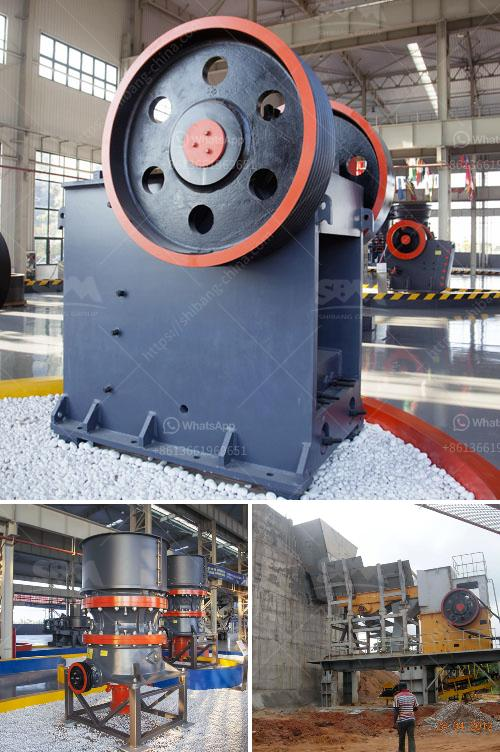

<h3>small scale mobile sand and stone crushers</h3>
In recent years, due to the improvement of environmental protection measures and the increasingly strict management of mining rights, small-scale sand and stone mining has been restricted. However, with the advancement of technology, small-scale mobile sand and stone crushers have gradually entered the market, allowing mining enterprises to have more possibilities.

The use of small-scale mobile sand and stone crushers has been widely recognized by many users due to their flexibility, convenience, and high operation efficiency. In particular, the crushers can meet the requirements of different materials, allowing customers to choose the most suitable crushing equipment for their needs. Whether it is crushing river pebbles, granite, or construction waste, these mobile crushers can process them with ease.

One of the advantages of small-scale mobile sand and stone crushers is their ability to move easily. Unlike stationary crushers that require transportation on trailers, these crushers are mounted on tracks or wheels, allowing them to be easily transported to different sites. This mobility significantly reduces the transportation costs and time required, making the crushers more accessible to small and medium-scale mining enterprises.

Another benefit of small-scale mobile sand and stone crushers is their cost-effectiveness. Compared to large-scale crushing equipment, these crushers are much cheaper, both in terms of initial investment and operating costs. This affordability makes them an attractive option for small-scale mining enterprises with limited budgets. Additionally, the crushers are designed for easy maintenance, reducing the need for specialized technicians and further lowering operational expenses.

Furthermore, small-scale mobile sand and stone crushers play a vital role in promoting local economic development. By providing opportunities for small-scale miners to access and process valuable resources, these crushers contribute to regional employment, income generation, and the overall economic growth. They also help to prevent illegal mining activities, as small-scale miners are more likely to comply with regulations when they have legal means to extract and process resources.

However, it is essential to note that the utilization of small-scale mobile sand and stone crushers should be strictly regulated. While they bring numerous benefits, unrestrained mining activities can still lead to environmental degradation and social impacts. Local governments and mining authorities should establish and enforce proper mining regulations, ensuring that operations are carried out in an environmentally sustainable and socially responsible manner.

In conclusion, small-scale mobile sand and stone crushers have become an indispensable tool for small and medium-scale mining enterprises. Their mobility, cost-effectiveness, and positive impact on local economies make them a preferred choice for many miners. Nevertheless, regulators and stakeholders must work together to ensure that these crushers are used responsibly and sustainably, safeguarding the environment and the welfare of communities. With proper management, these crushers can contribute to the development of the mining industry while minimizing its potential negative consequences.
<h3>Contact us</h3><ul><li><strong>Whatsapp:&nbsp;<a href="https://wa.me/8613661969651">+8613661969651</a></strong></li><li><a href="https://swt.shibang-china.com/?git&amp;zhl&amp;small scale mobile sand and stone crushers"><strong>Online Service(chat now)</strong></a></li></ul><h3>Related</h3><ul><li><a href='small scale gold processing machines price list.md'>small scale gold processing machines price list</a></li><li><a href='kenya raymond mill.md'>kenya raymond mill</a></li><li><a href='crushing stone made in germany.md'>crushing stone made in germany</a></li><li><a href='combined gold and diamond wash plants.md'>combined gold and diamond wash plants</a></li><li><a href='ultra fine grinding mill for limestone.md'>ultra fine grinding mill for limestone</a></li></ul>