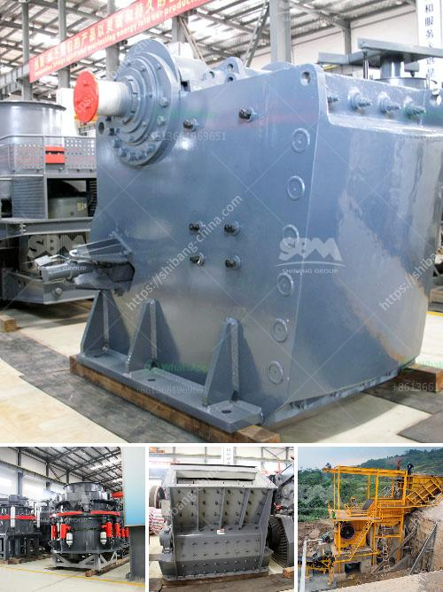

<h3>small scale tantalum milling machine supplier</h3>
Tantalum is a rare, hard, blue-gray, lustrous transition metal that is highly corrosion-resistant. It is a vital element in various industries, ranging from electronics to aerospace and medical fields. Tantalum is mainly used in the production of capacitors, which are vital components in electronic devices. As the demand for tantalum continues to grow, more efficient methods of extraction and processing are being sought, and small-scale tantalum milling machine suppliers are stepping up to the challenge.

One such small-scale tantalum milling machine supplier is Eastman. The company offers a wide range of tantalum milling options, from laboratory-scale machines to full-scale production plants. With extensive experience in the industry, Eastman understands the challenges faced by tantalum producers and aims to provide efficient solutions.

One of the key advantages of Eastman's tantalum milling machines is their ability to produce a high-quality product at a competitive price. The company utilizes advanced technology and state-of-the-art equipment to ensure that every milling machine meets the highest standards. This not only ensures the quality of the final product but also reduces wastage during the milling process, resulting in cost savings for the producer.

Furthermore, Eastman's tantalum milling machines are designed for ease of use and maintenance. The company provides comprehensive training and support to ensure that operators can operate the machines efficiently and effectively. Additionally, Eastman's machines are built to last, with robust construction and high-quality components that minimize downtime and maintenance requirements.

Another crucial aspect of Eastman's tantalum milling machines is their commitment to sustainability. The company understands the environmental impact of mining and processing tantalum and aims to minimize it through responsible manufacturing practices. Eastman's machines are designed to be energy-efficient, minimizing their carbon footprint. The company also emphasizes the importance of waste management and recycling, providing solutions to effectively deal with tantalum waste.

Eastman's small-scale tantalum milling machines are not limited to the extraction and processing of tantalum alone. They can also be customized to accommodate other minerals and ores, making them versatile and adaptable to various mining operations. This flexibility allows producers to optimize their milling processes and maximize their overall output.

In conclusion, small-scale tantalum milling machine suppliers like Eastman are playing a crucial role in the tantalum industry by offering efficient and sustainable solutions. With their high-quality machines, commitment to sustainability, and ability to customize milling processes, they are helping producers maximize their efficiency and produce top-quality tantalum products. As the demand for tantalum continues to rise, these suppliers will undoubtedly continue to be at the forefront of innovation in the industry.
<h3>Contact us</h3><ul><li><strong>Whatsapp:&nbsp;<a href="https://wa.me/8613661969651">+8613661969651</a></strong></li><li><a href="https://swt.shibang-china.com/?git&amp;zhl&amp;small scale tantalum milling machine supplier"><strong>Online Service(chat now)</strong></a></li></ul><h3>Related</h3><ul><li><a href='application of ball mill in industries.md'>application of ball mill in industries</a></li><li><a href='crushing plants for sale in south africa.md'>crushing plants for sale in south africa</a></li><li><a href='grinding machine philippines.md'>grinding machine philippines</a></li><li><a href='silica quartz crushing plant.md'>silica quartz crushing plant</a></li><li><a href='how to decrease the dust in a crushing plant.md'>how to decrease the dust in a crushing plant</a></li></ul>