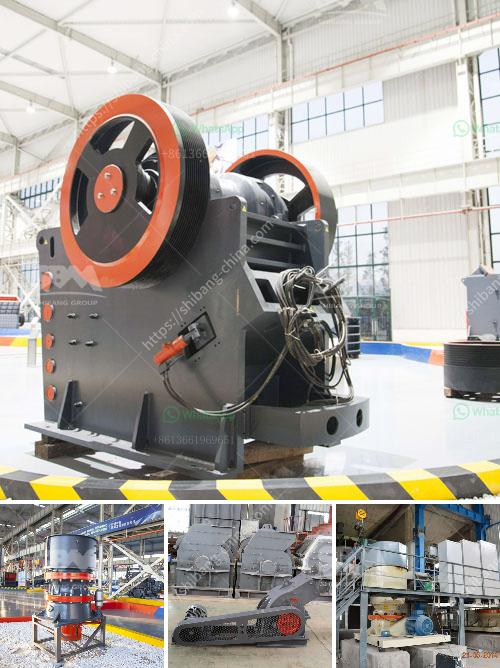

<h3>small size mobile ore crushers</h3>
In the world of mining, ores are often found in large deposits, making it challenging for small-scale miners to extract the valuable metals. However, with the advancements in technology, there are now compact and portable ore crushers that can be easily transported to the mining site and used to crush and process ores. These small size mobile crushers offer a convenient solution for miners who need to access and process smaller quantities of ore.

One of the primary advantages of using small size mobile ore crushers is their portability. Unlike traditional crushers, which are usually cumbersome and require permanent installation, these mobile crushers can be easily transported to different mining sites. This flexibility allows miners to move from one location to another, depending on where the ore deposits are, without having to invest in multiple crushers or build permanent infrastructures.

Another significant advantage of small size mobile ore crushers is their efficiency. These crushers are typically designed to crush and process smaller quantities of ore, which aligns perfectly with the needs of small-scale miners. By using these crushers, miners can avoid the high costs associated with larger crushers that are more suitable for industrial-scale operations. Furthermore, the smaller size of these crushers means less energy is required to crush the ore, resulting in lower energy consumption and reduced operating costs.

Additionally, small size mobile ore crushers are equipped with the latest technology to ensure efficient and precise crushing. These crushers often employ advanced features such as adjustable settings, allowing miners to customize the size of the final product. This enables miners to extract the desired metals with minimal waste, maximizing their return on investment.

Lastly, these crushers are often equipped with diesel engines or electric motors, which provide a reliable source of power. Small-scale miners operating in remote locations with limited access to electricity can still leverage these mobile crushers to process their ores effectively.

In conclusion, small size mobile ore crushers offer an ideal solution for small-scale miners seeking to extract metals from smaller quantities of ore. Their portability, efficiency, advanced technology, and reliable power sources make them highly suitable for such operations. With these crushers, small-scale miners can access and process their ores conveniently and cost-effectively, ultimately enhancing their mining ventures.
<h3>Contact us</h3><ul><li><strong>Whatsapp:&nbsp;<a href="https://wa.me/8613661969651">+8613661969651</a></strong></li><li><a href="https://swt.shibang-china.com/?git&amp;zhl&amp;small size mobile ore crushers"><strong>Online Service(chat now)</strong></a></li></ul><h3>Related</h3><ul><li><a href='tones per hour in limestone prduction.md'>tones per hour in limestone prduction</a></li><li><a href='quarry crushing equipment.md'>quarry crushing equipment</a></li><li><a href='raymond mill manufacturers in india.md'>raymond mill manufacturers in india</a></li><li><a href='used mobile crushing plant trailer.md'>used mobile crushing plant trailer</a></li><li><a href='high energy ball mill price.md'>high energy ball mill price</a></li></ul>