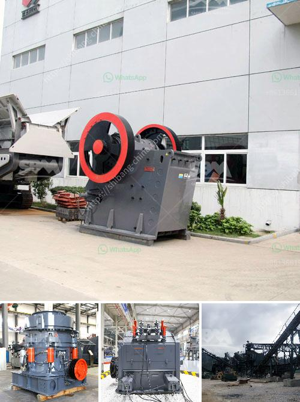

<h3>small stone crushers ontario canada</h3>
Small stone crushers are a relatively common type of equipment in Ontario, Canada. They are generally used to crush various types of rocks such as granite, limestone, basalt, etc., as well as concrete and construction waste materials. With the increasing demand for small stone crushers in the construction and mining industries, the market for these equipment has also shown significant growth.

One of the key advantages of small stone crushers is their mobility. Most of these crushers are equipped with wheels, allowing them to be easily transported from one site to another. This is particularly useful in construction projects where stone crushing is required at multiple locations. The mobility of these crushers makes it possible to crush and process materials on-site, reducing the need for transporting rocks and other materials to a centralized crushing facility.

In addition to their mobility, small stone crushers are also highly efficient in terms of crushing and processing stone. They are designed to crush materials into smaller sizes, which can then be used as aggregate for various construction purposes, such as road construction, building foundations, and landscaping. The small size of the crushed stones also facilitates their use in various applications, such as creating pathways, driveways, and decorative stone features.

Another notable feature of small stone crushers is their affordability. Compared to larger stone crushing equipment, small crushers are generally more affordable and accessible to small-scale contractors and homeowners. This affordability makes them a popular choice for DIY projects and small construction companies that do not have the budget or need for larger crushing equipment. Furthermore, the maintenance and operating costs of small stone crushers are also relatively low, making them a cost-effective solution for stone crushing needs.

In Ontario, Canada, there are several companies and suppliers that specialize in small stone crushers. These companies offer a range of crushers with different capacities and features to suit various crushing requirements. Some of these crushers are available for purchase, while others can be rented for short-term projects. Additionally, these companies may also provide support services such as delivery, installation, and maintenance of the crushers.

Overall, small stone crushers in Ontario, Canada serve as a practical and cost-effective solution for crushing and processing various types of rocks and construction materials. Their mobility, efficiency, and affordability make them a popular choice among contractors and homeowners alike. With the growing demand for stone crushers in the construction and mining industries, the market for small stone crushers is expected to continue expanding in Ontario, Canada.
<h3>Contact us</h3><ul><li><strong>Whatsapp:&nbsp;<a href="https://wa.me/8613661969651">+8613661969651</a></strong></li><li><a href="https://swt.shibang-china.com/?git&amp;zhl&amp;small stone crushers ontario canada"><strong>Online Service(chat now)</strong></a></li></ul><h3>Related</h3><ul><li><a href='quartz plant and machinary.md'>quartz plant and machinary</a></li><li><a href='machinery for hydrated lime powder.md'>machinery for hydrated lime powder</a></li><li><a href='mobile coal jaw crusher for hire.md'>mobile coal jaw crusher for hire</a></li><li><a href='silica sand grinding.md'>silica sand grinding</a></li><li><a href='flowsheet for crushing plant.md'>flowsheet for crushing plant</a></li></ul>