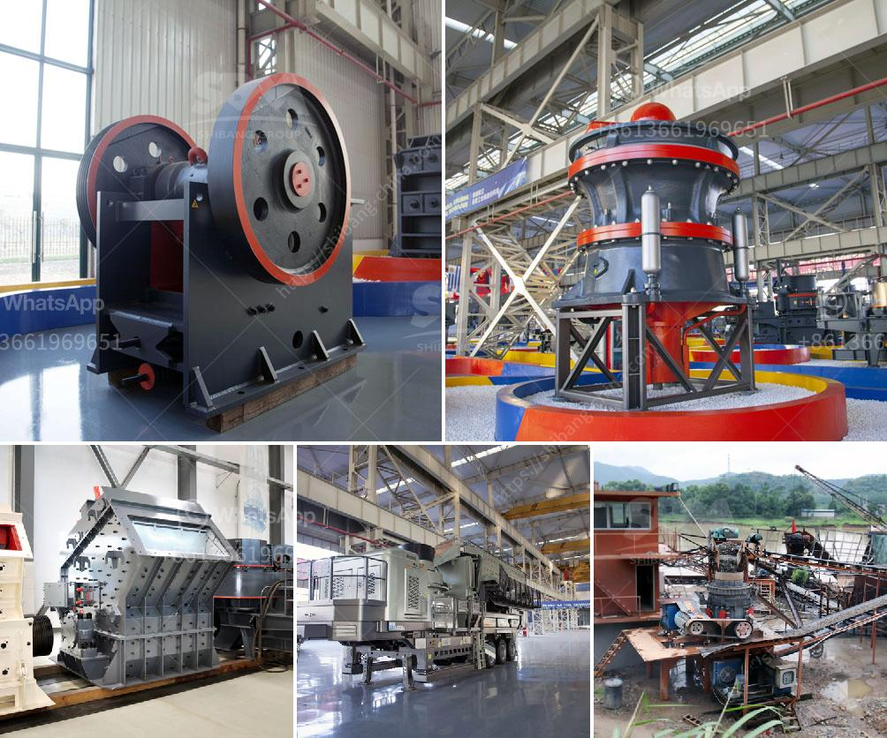

<h3>small washing plants diamonds</h3>
The diamond industry is a vast and highly lucrative industry that holds great economic potential. Diamonds are one of the world's most precious gems and are often used in luxury jewelry and industrial applications. However, the process of extracting diamonds from the earth can be quite complex and challenging. That's where small washing plants for diamonds come into play.

Small washing plants for diamonds are compact and efficient machines designed to recover diamonds from alluvial deposits, which are often found in riverbeds, beaches, or offshore areas. These machines play a crucial role in the diamond mining process, making it easier for miners to extract and process the precious gem.

One of the key advantages of small washing plants is their portability. Being small and lightweight, these plants can be easily transported to remote locations where alluvial diamond deposits are scattered. This mobility allows miners to set up temporary camps close to the mining site, reducing the transport time and costs associated with large-scale mining operations.

Small washing plants for diamonds are also highly effective in capturing and separating the precious gemstones from other material. These plants employ various techniques such as pulsating water, vibration, and gravity to remove the gravel, sand, and clay that often accompany alluvial diamond deposits. The diamond-rich material is then subjected to further processing to refine and sort the diamonds according to their size, shape, and quality.

By utilizing small washing plants, diamond miners can maximize their recovery rates and minimize the loss of diamonds during the extraction process. This is particularly important considering the high value of diamonds and the competitiveness of the industry. Small washing plants ensure that even the tiniest diamonds are not overlooked or washed away, increasing the profitability of mining operations.

Moreover, small washing plants for diamonds are designed to be environmentally friendly. They use minimal water and avoid the use of harmful chemicals, minimizing potential pollution and damage to the surrounding ecosystems. Additionally, these plants require a small footprint, reducing land disturbance and ensuring the preservation of the natural landscape.

In recent years, technological advancements have further enhanced the efficiency and effectiveness of small washing plants for diamonds. Sophisticated sensors and sorting systems have been integrated into these plants, allowing for automated and precise diamond recovery. This reduces the reliance on manual labor and increases the productivity of mining operations.

Small washing plants for diamonds have revolutionized the diamond mining industry by making the extraction process more efficient, cost-effective, and environmentally friendly. These plants have become essential tools for miners, particularly in remote and hard-to-reach areas where larger-scale operations are not feasible.

The future of small washing plants for diamonds looks promising, with ongoing research and development aimed at further improving their capabilities. With continuous advancements in technology and growing demand for diamonds, these plants will continue to play a crucial role in the diamond mining industry, ensuring the supply of these precious gems for generations to come.
<h3>Contact us</h3><ul><li><strong>Whatsapp:&nbsp;<a href="https://wa.me/8613661969651">+8613661969651</a></strong></li><li><a href="https://swt.shibang-china.com/?git&amp;zhl&amp;small washing plants diamonds"><strong>Online Service(chat now)</strong></a></li></ul><h3>Related</h3><ul><li><a href='belt conveyor for sale china.md'>belt conveyor for sale china</a></li><li><a href='quarry stone business plan pdf.md'>quarry stone business plan pdf</a></li><li><a href='screen clay from limestone rock.md'>screen clay from limestone rock</a></li><li><a href='complete crushing plant solutions prices.md'>complete crushing plant solutions prices</a></li><li><a href='primary impact crusher.md'>primary impact crusher</a></li></ul>