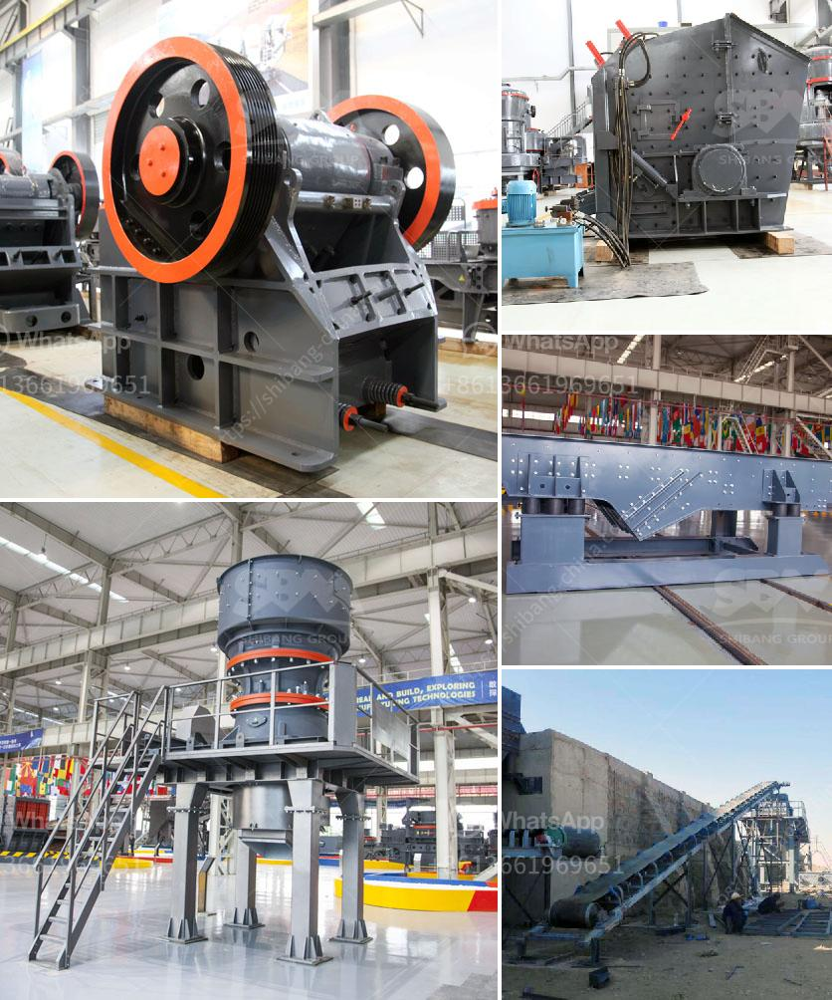

<h3>stacker conveyors suppliers</h3>
Stacker conveyors are an integral part of the material handling industry. These machines play a crucial role in efficiently managing and transporting bulk materials in various sectors such as mining, construction, and manufacturing. Stacker conveyors suppliers offer a wide range of products to cater to the diverse needs of the industry. In this article, we will explore the important aspects of stacker conveyors and discuss some reputable suppliers in the market.

Stacker conveyors are designed to stack or reclaim materials in a controlled and automated manner. They are typically used for stockpiling bulky materials such as coal, ore, aggregates, and other bulk commodities. These machines consist of a long conveyor belt mounted on a track system that can move along the stockpile area. Stacker conveyors can stack materials in a cone-like shape, ensuring maximum storage capacity in a limited space. They can also reclaim materials from a stockpile and transfer them to other conveyors or transport vehicles.

The selection of a stacker conveyor supplier is crucial for the smooth operation and productivity of the material handling system. A reputable supplier will provide reliable equipment that can efficiently handle the specific requirements of the industry. When choosing a supplier, it is important to consider factors such as reliability, durability, performance, and after-sales support.

One well-known stacker conveyor supplier is ABC Manufacturing. With years of experience in the industry, ABC Manufacturing offers a wide range of stacker conveyors that are known for their high-quality construction and dependable performance. Their stacker conveyors are designed to withstand harsh conditions and heavy-duty applications, making them suitable for various industries.

Another reliable supplier is XYZ Conveyors. They are a leading manufacturer of stacker conveyors with a reputation for providing innovative and reliable solutions. XYZ Conveyors offer a diverse product line that includes stacker conveyors with different lengths, belt widths, and stacking heights, allowing customers to find the right equipment for their specific needs.

Additionally, DEF Solutions is a reputable supplier that specializes in stacker conveyors for the mining industry. Their stacker conveyors are designed to handle the rough conditions and heavy loads of mining operations. DEF Solutions' stacker conveyors are known for their durability, efficiency, and low maintenance requirements, making them a popular choice among mining companies.

It is worth mentioning that stacker conveyors suppliers also provide customization options to meet specific customer requirements. They understand that different sectors have unique material handling needs, and offer tailored solutions accordingly. Whether it is a specific belt width, stacking height, or additional features, reputable suppliers ensure that their stacker conveyors can be customized to enhance efficiency and productivity.

In conclusion, stacker conveyors suppliers play a crucial role in the material handling industry. These suppliers offer a diverse range of stacker conveyors that can efficiently handle the stacking and reclaiming of bulk materials. When selecting a supplier, it is important to consider factors such as reliability, durability, performance, and after-sales support. Reputable suppliers like ABC Manufacturing, XYZ Conveyors, and DEF Solutions are known for their high-quality stacker conveyors that meet the specific requirements of various industries.
<h3>Contact us</h3><ul><li><strong>Whatsapp:&nbsp;<a href="https://wa.me/8613661969651">+8613661969651</a></strong></li><li><a href="https://swt.shibang-china.com/?git&amp;zhl&amp;stacker conveyors suppliers"><strong>Online Service(chat now)</strong></a></li></ul><h3>Related</h3><ul><li><a href='small scale mining equipment in nigeria.md'>small scale mining equipment in nigeria</a></li><li><a href='cost 100tpd cement plant india.md'>cost 100tpd cement plant india</a></li><li><a href='zinc crusher machine zimbabwe.md'>zinc crusher machine zimbabwe</a></li><li><a href='roller mill nigeria.md'>roller mill nigeria</a></li><li><a href='gold mill tailings processing equipment.md'>gold mill tailings processing equipment</a></li></ul>