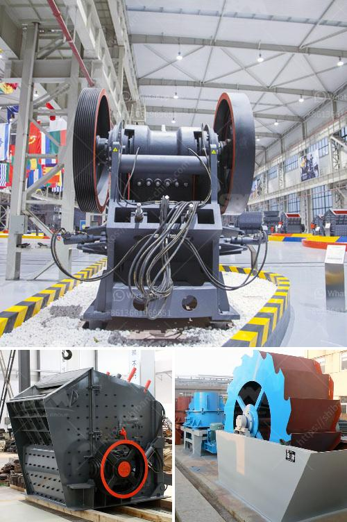

<h3>stained glass grinder machine for sale</h3>
If you are an avid stained glass artist, you know the importance of having the right tools to create beautiful and intricate designs. One essential tool that every stained glass artist should have in their arsenal is a stained glass grinder machine. A stained glass grinder machine enables you to shape, smooth, and polish your glass pieces, allowing you to create stunning works of art with ease. If you are in the market for a stained glass grinder machine, look no further – we have the perfect solution for you.

Our stained glass grinder machine for sale comes equipped with a powerful motor and a diamond grinding bit that offers ultra-fast grinding and shaping. With its sturdy construction and high-quality components, you can be assured that this grinder machine will stand the test of time and provide reliable performance for years to come.

One of the standout features of our stained glass grinder machine is its adjustable water flow system. This system ensures that your glass remains cool during the grinding process, preventing any cracking or damage that may occur due to excessive heat. The continuous water flow also helps to flush away glass particles and debris, keeping your work area clean and reducing the risk of contamination.

In addition to its exceptional functionality, our stained glass grinder machine also boasts a user-friendly design. The grinder machine features a large, easy-to-use on/off switch that allows for effortless operation. The generously sized work surface provides ample space to work on larger glass pieces, and the removable water tray makes it convenient to clean and refill.

Furthermore, safety is a top priority when it comes to working with any power tool. Our stained glass grinder machine has been specifically designed with safety in mind. The grinder machine includes a protective shield to prevent any accidental contact with the grinding bit, providing you with peace of mind while working on your projects.

Investing in a stained glass grinder machine opens up a world of possibilities in terms of creativity and design. Whether you are a professional stained glass artist or a hobbyist, having a reliable grinder machine allows you to achieve precision and finesse in your work. Shape and smooth the edges of your glass pieces, refine intricate details, and create unique textures and designs – the options are endless.

So, why wait? Take your stained glass artistry to the next level with our stained glass grinder machine for sale. With its powerful performance, user-friendly design, and safety features, this machine is an invaluable tool for any stained glass artist. Let your creativity shine with the help of our high-quality grinder machine. Don't miss out on this opportunity – invest in a stained glass grinder machine today and let your artistic vision take flight.
<h3>Contact us</h3><ul><li><strong>Whatsapp:&nbsp;<a href="https://wa.me/8613661969651">+8613661969651</a></strong></li><li><a href="https://swt.shibang-china.com/?git&amp;zhl&amp;stained glass grinder machine for sale"><strong>Online Service(chat now)</strong></a></li></ul><h3>Related</h3><ul><li><a href='dry grinders mills.md'>dry grinders mills</a></li><li><a href='sell jaw crusher.md'>sell jaw crusher</a></li><li><a href='copper ore ball mill torky.md'>copper ore ball mill torky</a></li><li><a href='hp series cone crusher.md'>hp series cone crusher</a></li><li><a href='crusher plant in kenya.md'>crusher plant in kenya</a></li></ul>