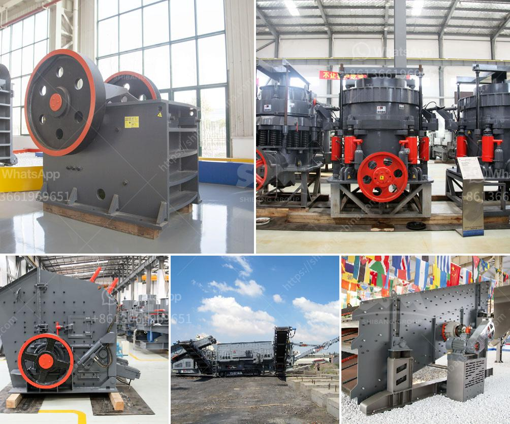

<h3>stamp mills for sale in zimbabwe</h3>
Stamp mills in Zimbabwe process at 1 450 microns size compared to appropriate technologies like hammer mills, which process at 400 microns — three times more than a stamp mill, according to a report by Midlands Metals, which was approved by the Zimbabwe School of Mines.

Inserted by Skez-WhatsApp: Some of the operating costs stem from mining entities paying between US$80 and US$100 per tonne for the concentrate, in addition to processing costs, while other players avoid such costs, Deputy Finance and Economic Development Minister Clemence Chiduwa said.

Inserted by Skez-WhatsApp+: Workers at Big Valley Masters Mine load gold ore into a crusher that breaks the rock into a finer dust. The gold is then submitted to a gravity separation process that concentrates the fine bits of ore into quantities that can be transported for further processing.

Zimbabwe has a long history of gold production stretching back many centuries and gold is by any estimate a mineral with the longest mining history of the country. The gold industry is characterised by large greenstone belts which support many small mines which are privately owned. A United Nations working paper of 1995, on gold mining in Zimbabwe, estimates over 5000 small scale gold mines.

In my opinion, the stamp mill and hammer mill sold by Zimbabwean craftsmen are powerful tools designed to crush and grind gold-bearing rocks into powder to liberate gold particles from the barren ore. These mills are ideal for small and medium-scale miners in Zimbabwe. They are cost-effective as they are low-tech and practically maintenance-free, and need no fuel or electricity, which makes them ideal for remote areas. They are simple to operate, and miners can consistently process their gold-bearing ore in small batches, reducing the loss of potential revenue.

With the advent of technology, many traditional processes have been replaced by advanced machinery. However, in certain industries, traditional methods still hold their ground due to their effectiveness and low-cost nature. The gold mining industry in Zimbabwe is one such industry, where miners still rely heavily on stamp mills. This age-old technology allows them to crush and grind gold-bearing rocks and extract the valuable ore.

One of the major advantages of stamp mills is their ability to pulverize ore into fine particles, making the gold easier to extract. The process involves feeding the rocks into the stamp mill, which is then activated by a water-powered mechanism. As the heavy stamps crush the rocks, the gold particles are released and collected by riffles, which are shallow washing troughs. The recovered gold is then further processed using gravity separation techniques.

Stamp mills in Zimbabwe come in various sizes and models, ranging from those suitable for small-scale miners to larger mills that can process vast quantities of ore. These mills can be operated manually or through a motor and are relatively affordable, making them accessible to many miners. 

In conclusion, stamp mills are still relevant and crucial in the gold mining industry in Zimbabwe. They provide a simple and cost-effective way for miners to extract gold from rocks. The availability of stamp mills for sale in Zimbabwe can be a game-changer for many small and medium-scale miners who are looking to boost their operations.
<h3>Contact us</h3><ul><li><strong>Whatsapp:&nbsp;<a href="https://wa.me/8613661969651">+8613661969651</a></strong></li><li><a href="https://swt.shibang-china.com/?git&amp;zhl&amp;stamp mills for sale in zimbabwe"><strong>Online Service(chat now)</strong></a></li></ul><h3>Related</h3><ul><li><a href='cercetare ball mill in rimania.md'>cercetare ball mill in rimania</a></li><li><a href='quartz silica old plant sale at telgana.md'>quartz silica old plant sale at telgana</a></li><li><a href='coal drying plant manufacture in india.md'>coal drying plant manufacture in india</a></li><li><a href='proposal for cement plant crusher.md'>proposal for cement plant crusher</a></li><li><a href='mobile concrete crusher.md'>mobile concrete crusher</a></li></ul>