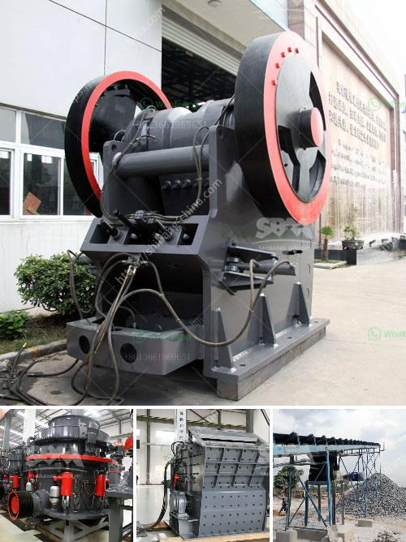

<h3>standard operating procedure of ball mill</h3>
The standard operating procedure of a ball mill allows for about 0.1 g of material to be lost per test. It is recommended that, in a ball mill, the material undergo grinding for at least 5 minutes before the test samples are taken. To ensure accuracy, multiple samples should be taken at different times, especially for multiple tests.

One should also note that the grinding time for a ball mill varies depending on the type of material being processed. For example, metallic powders require a shorter duration compared to materials such as pigments or dyes. Therefore, it is essential to establish the appropriate grinding time beforehand to achieve optimal results.

Another critical factor to consider is the speed of the ball mill. As a rule of thumb, the higher the mill speed, the finer the material that can be processed. However, it is essential to keep in mind that increasing the mill speed also increases the energy consumption and wear on the mill liners and grinding media.

The next step in the standard operating procedure of a ball mill is to add the grinding media, such as grinding balls or rods. Of the grinding media, there are usually reports on how much media is required for the grinding process. Typically, there is a ratio for a given type of media that corresponds to the volume occupied by the media.

For example, a 50% volume of media should be in a mill with a 500-tonne capacity. This ratio does not change much as the mill capacity increases (e.g., 1 tonne per day to 1,000 tonnes per day), but its performance substantially improves. The milling process becomes much more efficient, and it is now known as the standard operating procedure for bead mills.

The mill consists of a rotating vessel filled with grinding media - usually metallic or ceramic balls - mixed with a continuous flow of feed and recycled material. The feed could be dry or wet, depending on the subsequent process and the nature of the material being processed.

The standard operating procedure for ball mills plays an important role in ensuring the optimal operation of the mill and achieving the desired production goals. It consists of a series of detailed steps that guide operators through the process.

Starting from a 0.1 g sample, the mill is loaded with grinding media and the material to be processed. The mill is sealed and then rotated to initiate size reduction. After the desired grinding time, samples are taken at various intervals during the process. These samples are then analyzed to determine the particle size distribution and other pertinent information.

In conclusion, the standard operating procedure of a ball mill allows for precise grinding of materials, ensuring the production of high-quality and uniform products. Moreover, it provides a safe and efficient method for the production of quality materials, making it an essential tool for many industries.
<h3>Contact us</h3><ul><li><strong>Whatsapp:&nbsp;<a href="https://wa.me/8613661969651">+8613661969651</a></strong></li><li><a href="https://swt.shibang-china.com/?git&amp;zhl&amp;standard operating procedure of ball mill"><strong>Online Service(chat now)</strong></a></li></ul><h3>Related</h3><ul><li><a href='semi mobile crusher plant.md'>semi mobile crusher plant</a></li><li><a href='small stone crushers ontario canada.md'>small stone crushers ontario canada</a></li><li><a href='mobile screening plant.md'>mobile screening plant</a></li><li><a href='cement plant grinding unit.md'>cement plant grinding unit</a></li><li><a href='belt conveyors used in crushing plant.md'>belt conveyors used in crushing plant</a></li></ul>