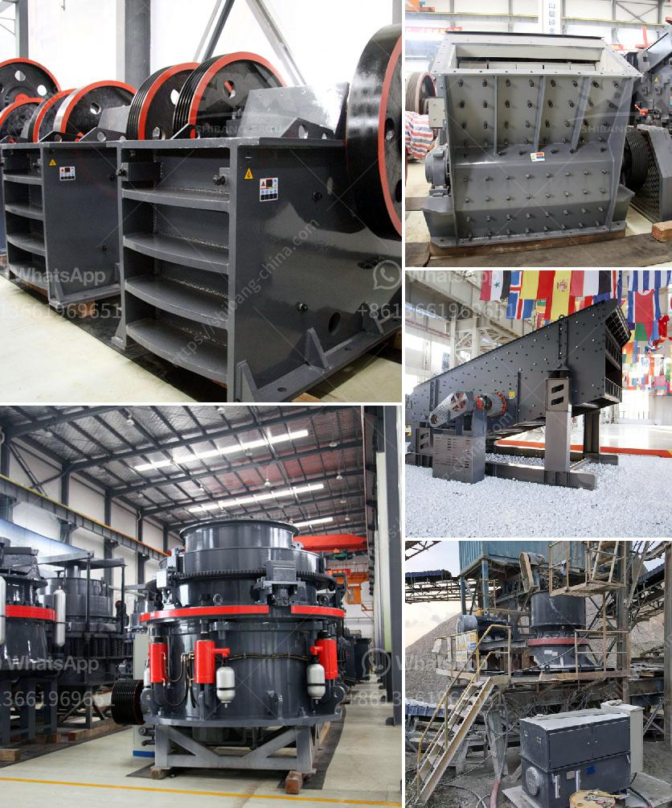

<h3>starting of ball mill with vfd</h3>
A ball mill is a type of grinder used to grind and blend materials for use in various industries. It works on the principle of impact and attrition: size reduction is done by impact as the balls drop from near the top of the shell. A ball mill consists of a hollow cylindrical shell rotating about its axis. The axis of the shell may be either horizontal or at a small angle to the horizontal. It is partially filled with balls. The grinding media is the balls, which may be made of steel, stainless steel, ceramic, or rubber. The inner surface of the cylindrical shell is usually lined with an abrasion-resistant material such as manganese steel or rubber.

To start the ball mill with the Variable Frequency Drive (VFD), it is necessary to ensure that the motor reaches its synchronous speed, and then gradually increase the frequency to the desired grinding speed.

The VFD can be controlled remotely for more precise and consistent grinding performances. This enables operators to optimize the grinding process and improve the overall efficiency of the operation. By adjusting the frequency and voltage, the VFD can provide greater control over the grinding process and reduce energy consumption.

The VFD also provides a soft start function, which eliminates the need for additional mechanical devices to start the mill, such as clutches or gearboxes. This reduces the mechanical stress on the equipment and prolongs its lifespan. Additionally, the VFD can provide overload protection, which prevents damage to the motor or the mill in case of excessive load or unexpected disturbances.

Overall, starting a ball mill with a VFD allows the operator to take full control of the grinding process, ensuring optimal performance and energy efficiency. This not only improves the quality of the final product but also reduces operational costs. As a result, the use of VFDs to start and control ball mills is becoming more prevalent in the mining and cement industries, as well as in other applications where size reduction is required.
<h3>Contact us</h3><ul><li><strong>Whatsapp:&nbsp;<a href="https://wa.me/8613661969651">+8613661969651</a></strong></li><li><a href="https://swt.shibang-china.com/?git&amp;zhl&amp;starting of ball mill with vfd"><strong>Online Service(chat now)</strong></a></li></ul><h3>Related</h3><ul><li><a href='shaft hammer crusher hds.md'>shaft hammer crusher hds</a></li><li><a href='ultra conveyor belts usa.md'>ultra conveyor belts usa</a></li><li><a href='gypsum processing machines.md'>gypsum processing machines</a></li><li><a href='quarry crushing equipment.md'>quarry crushing equipment</a></li><li><a href='bentonite powder machine.md'>bentonite powder machine</a></li></ul>