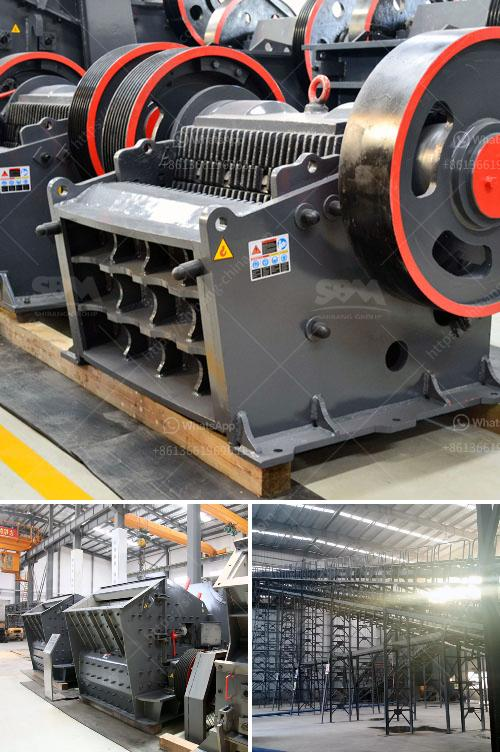

<h3>starting up a small scale gold mine in zimbabwe</h3>
Zimbabwe is endowed with abundant mineral resources, including gold, diamond, and platinum, making it a favorable destination for small-scale mining entrepreneurs. With over 40 different types of minerals being mined across the country, the prospect of starting up a small-scale gold mine is evidently a lucrative opportunity. In this article, we will explore the steps involved in establishing a small-scale gold mine in Zimbabwe.

Before embarking on any mining venture, thorough research is essential. This involves studying the geology of the targeted area, analyzing the potential reserves, and assessing the viability of establishing a small-scale gold mine. Consultation with geologists, mining engineers, and the local mining authority can provide valuable insights and guidance.

Mining in Zimbabwe requires specific permits and licenses to operate legally. Seek guidance from the Ministry of Mines and Mining Development to understand the legal requirements. It is crucial to obtain a mining license, environmental impact assessment (EIA) certificate, and adhere to the relevant safety regulations.

For starting up a small-scale gold mine, securing adequate funding is vital. Approach banks, investors, or crowdfunding platforms to discuss financial support options. Compose a comprehensive business plan highlighting the financial projections, including expected operating costs, equipment purchase, and projected returns on investment. Acquiring the necessary mining equipment, such as excavators, crushers, and gold processing machines, is crucial for efficient operations.

Building relationships with local communities, government officials, and other stakeholders is fundamental to successful small-scale mining operations. Engage in open dialogue, address concerns, and establish good relations with the community. By demonstrating the potential benefits of mining, including job creation and infrastructure development, you can gain their support and cooperation.

Sustainable mining practices are crucial for the long-term success of any mining venture. Adhere to ethical mining practices, ensuring environmental responsibility and the safety and health of the miners. Minimize the use of hazardous chemicals, promote reclamation of mined areas, and provide training on safe mining practices to the workforce.

To maximize profitability, adopt efficient gold recovery techniques. Undertake proper ore sampling and testing to determine the gold concentration and choose the appropriate gold extraction method. Technologies such as gravity concentration, flotation, or cyanide leaching can be employed, depending on the ore characteristics and economic feasibility.

Zimbabwe has specific export procedures for mineral commodities. Familiarize yourself with these regulations and ensure strict compliance to avoid any legal issues. Proper documentation and adherence to export policies will facilitate smooth transactions and the realization of value from the mined gold.

Starting up a small-scale gold mine in Zimbabwe presents a unique opportunity for aspiring miners. With careful planning, adequate funding, and adherence to legal requirements and sustainable practices, this venture can yield considerable returns. Engaging with local communities and stakeholders, as well as implementing efficient gold recovery techniques, will contribute to the long-term success of the mine. By tapping into Zimbabwe's rich gold potential, entrepreneurs have a chance to contribute to the country's economic growth and development.
<h3>Contact us</h3><ul><li><strong>Whatsapp:&nbsp;<a href="https://wa.me/8613661969651">+8613661969651</a></strong></li><li><a href="https://swt.shibang-china.com/?git&amp;zhl&amp;starting up a small scale gold mine in zimbabwe"><strong>Online Service(chat now)</strong></a></li></ul><h3>Related</h3><ul><li><a href='barite mining crusher in nigeria.md'>barite mining crusher in nigeria</a></li><li><a href='barium powder production machine.md'>barium powder production machine</a></li><li><a href='limestone processing plant philippines.md'>limestone processing plant philippines</a></li><li><a href='cost analysis of stone quarry in india.md'>cost analysis of stone quarry in india</a></li><li><a href='cement boll mill grinding.md'>cement boll mill grinding</a></li></ul>