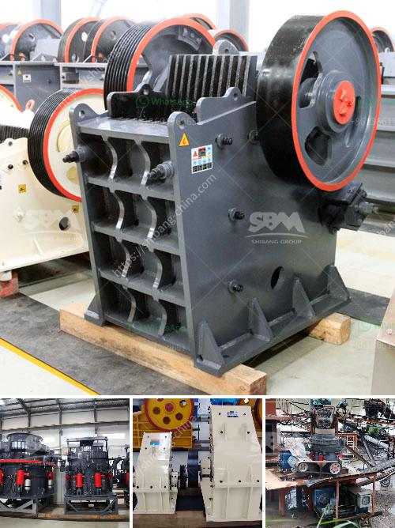

<h3>steel rolling mill plant suppliers</h3>
The steel industry plays a crucial role in shaping the modern world. Whether it is construction, infrastructure, automotive, or any other sector, steel is an essential material. To meet the ever-increasing demand for steel, steel rolling mill plants are deployed across the globe. These plants are responsible for converting raw materials into finished steel products. However, establishing a steel rolling mill plant requires expertise and high-quality machinery. In this article, we will discuss steel rolling mill plant suppliers, their importance, and key considerations.

Steel rolling mill plant suppliers are specialized companies that provide turnkey solutions for setting up steel rolling mills. They offer a wide range of services, including design, engineering, procurement, manufacturing, installation, and commissioning. These suppliers have extensive experience and knowledge in the field of steel rolling mills, enabling them to provide comprehensive solutions to their clients.

Choosing the right steel rolling mill plant supplier is crucial for achieving optimal results. A reputable supplier will not only provide high-quality machinery but will also offer technical support and after-sales services. Here are some key considerations when selecting a supplier:

1. Expertise: Look for a supplier with a proven track record in delivering successful steel rolling mill projects. Assess their experience, qualifications, and capabilities in terms of project management, engineering, and manufacturing.

2. Quality: The quality of equipment and machinery supplied by the supplier is crucial for the performance and longevity of the steel rolling mill plant. Make sure the supplier adheres to international quality standards and uses advanced manufacturing processes.

3. Customization: Every steel rolling mill plant has specific requirements. The supplier should be able to provide customized solutions tailored to meet the needs of the client. This includes customizing the size, capacity, and features of the equipment.

4. Service: A reliable supplier should offer comprehensive services, including installation, training, maintenance, and spare parts support. Look for suppliers that have a strong global presence and can provide prompt assistance whenever required.

5. Cost-effectiveness: While cost is an important factor, it should not be the sole criterion for choosing a supplier. The focus should be on attaining the best value for money by considering the supplier's expertise, quality of equipment, and after-sales services.

In conclusion, steel rolling mill plant suppliers play a vital role in the steel industry by providing turnkey solutions for setting up rolling mills. Their expertise, high-quality machinery, and comprehensive services are essential for the successful establishment and operation of steel rolling mill plants. Therefore, it is crucial to carefully select a supplier based on factors such as expertise, quality, customization, service, and cost-effectiveness. By doing so, steel manufacturers can ensure the smooth and efficient operation of their rolling mill plants, meeting the growing demand for steel products.
<h3>Contact us</h3><ul><li><strong>Whatsapp:&nbsp;<a href="https://wa.me/8613661969651">+8613661969651</a></strong></li><li><a href="https://swt.shibang-china.com/?git&amp;zhl&amp;steel rolling mill plant suppliers"><strong>Online Service(chat now)</strong></a></li></ul><h3>Related</h3><ul><li><a href='small crushers for sale.md'>small crushers for sale</a></li><li><a href='new mini portable rock impact crusher.md'>new mini portable rock impact crusher</a></li><li><a href='types of grinding mill.md'>types of grinding mill</a></li><li><a href='ultra fine grinding mill for limestone.md'>ultra fine grinding mill for limestone</a></li><li><a href='eco stone crusher.md'>eco stone crusher</a></li></ul>