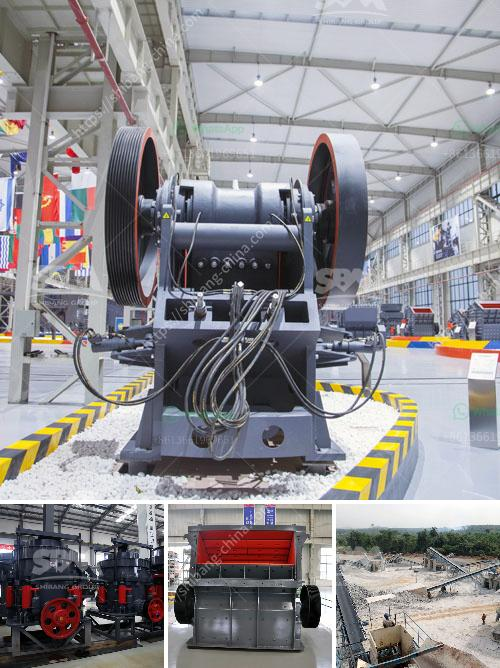

<h3>stone ball mill up to 2500 mesh</h3>
Grinding is a crucial process in many industries, including mining, cement, and pharmaceuticals. To ensure high-quality and finely ground products, manufacturers rely on powerful and reliable equipment. One such equipment widely used in grinding applications is the stone ball mill. With its ability to produce finely ground materials up to 2500 mesh, the stone ball mill offers a versatile and efficient grinding solution.

The stone ball mill is a cylindrical device used to grind (or mix) materials like ores, chemicals, ceramic raw materials, and paints. It rotates around a horizontal axis, partially filled with the material to be ground plus the grinding medium. Different materials are used as media, including ceramic balls, flint pebbles, and stainless steel balls. As the mill rotates, the grinding media chase surface contact with the material, resulting in efficient and uniform grinding.

One of the advantages of the stone ball mill is its ability to produce fine particles. The term "mesh" refers to the number of holes per linear inch in a sieve used for particle size analysis. A higher mesh number indicates finer particles. With stone ball mills, manufacturers can achieve particle sizes up to 2500 mesh, ensuring precision in product specifications. This fine particle size is crucial for various industries, including in making high-grade cement, pharmaceutical powders, and cosmetic products.

Furthermore, stone ball mills are also known for their efficiency. The grinding process in a ball mill relies on impact and attrition forces between the grinding media and the material being ground. Due to the cylindrical shape of the mill, the grinding media have greater surface area contact, resulting in efficient and rapid grinding. This enables manufacturers to process larger quantities of material in a shorter time, improving productivity and reducing energy consumption.

The stone ball mill's versatility is another key feature. Besides grinding, it can also be used for mixing and blending materials. This makes it ideal for applications where different materials need to be homogeneously mixed, for example, in the production of ceramic glazes or pharmaceutical powders. The ability to perform multiple functions in a single equipment saves time, space, and reduces the need for additional machinery.

In conclusion, the stone ball mill is a valuable and versatile tool for grinding and mixing applications. Its ability to produce finely ground materials up to 2500 mesh makes it ideal for industries dealing with high-precision products. Additionally, its efficiency in grinding and the ability to perform other functions like mixing and blending provide added value to manufacturers. Whether in mining, cement, or pharmaceuticals, the stone ball mill offers a reliable and efficient grinding solution for various industries.
<h3>Contact us</h3><ul><li><strong>Whatsapp:&nbsp;<a href="https://wa.me/8613661969651">+8613661969651</a></strong></li><li><a href="https://swt.shibang-china.com/?git&amp;zhl&amp;stone ball mill up to 2500 mesh"><strong>Online Service(chat now)</strong></a></li></ul><h3>Related</h3><ul><li><a href='chinese gypsum production line equipment.md'>chinese gypsum production line equipment</a></li><li><a href='how to grind sand into powder.md'>how to grind sand into powder</a></li><li><a href='stone quarry machine manufacturers.md'>stone quarry machine manufacturers</a></li><li><a href='gypsum board making machine supplier.md'>gypsum board making machine supplier</a></li><li><a href='ball mills for 6 x 6 mining.md'>ball mills for 6 x 6 mining</a></li></ul>