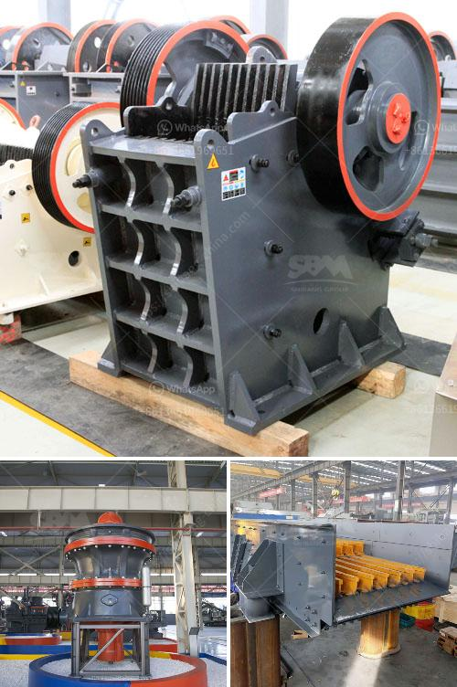

<h3>stone crusher 50tons per hour</h3>
Stone crusher machine is an essential tool for mining and construction projects. With the rapid development of infrastructure, many investors are investing in mineral projects like road construction, bridge construction, and highway construction. Among the various types of crushers available in the market, stone crushers have been proven to be the best option for efficient and reliable coarse crushing of hard and brittle materials. 

A stone crusher is a machine used to crush rocks into smaller pieces, usually for gravel or some other road or building application. Most stonecrushers have a hopper at the top, a container which holds the rock above the crusher and uses gravity to feed it in. Alternately, rock crushers can use a belt drive to continuously transport the rock into the crusher. 

The rotational movement of the drive motor is transferred to the eccentric bushing in the cone crusher through the V-belt pulley and the shaft. The cone crusher shaft generates the pendulum movement under the force of the eccentric sleeve, so that the surface of the crushing wall is sometimes close to or away from the surface of the rolling wall. Therefore, the material is continuously compressed and impacted in the crushing cavity. 

One particular model of stone crusher that is commonly used is the stone crusher 50tons per hour. This crusher can crush materials with size smaller than 425 mm such as granite, limestone, concrete, etc. It has a capacity of 50-100 tons per hour. It is an ideal crushing equipment for rocks with compressive strength under 350MPa.

Stone crushers have a wide range of applications in industries such as mining, metallurgy, road building, railways, water conservancy, and chemical industries. It is used to crush various materials with a compressive strength ranging from 147 to 245 MPa. 

The stone crusher 50tons per hour is widely used in highway, railway, construction, and other fields, and plays an important role in crushing various ores and bulk materials. The high efficiency compared with the general crushing ratio, high crushing efficiency, convenient repair and maintenance and low operation cost are its outstanding features. 

The stone crusher 50tons per hour has been engineered to crush rocks and minerals efficiently and reliably, making it a popular choice for high-capacity mining operations. It is equipped with an advanced control system that allows for continuous monitoring and adjustments to ensure optimal performance and reliability. 

In conclusion, the stone crusher 50tons per hour is an essential equipment for crushing various rocks and stones efficiently and reliably. It has a wide range of applications in mining, construction, road building, railways, and chemical industries. Its high efficiency, low operational cost, and easy maintenance make it a preferred choice among users. Consider investing in this machine for your next project and experience the benefits it offers.
<h3>Contact us</h3><ul><li><strong>Whatsapp:&nbsp;<a href="https://wa.me/8613661969651">+8613661969651</a></strong></li><li><a href="https://swt.shibang-china.com/?git&amp;zhl&amp;stone crusher 50tons per hour"><strong>Online Service(chat now)</strong></a></li></ul><h3>Related</h3><ul><li><a href='river pebble crusher supplier.md'>river pebble crusher supplier</a></li><li><a href='stone crusher kapasitas 300 400 ton jam.md'>stone crusher kapasitas 300 400 ton jam</a></li><li><a href='complete aggregate crushing plant in usa.md'>complete aggregate crushing plant in usa</a></li><li><a href='mini ball mill crusher.md'>mini ball mill crusher</a></li><li><a href='jaw crusher used india.md'>jaw crusher used india</a></li></ul>