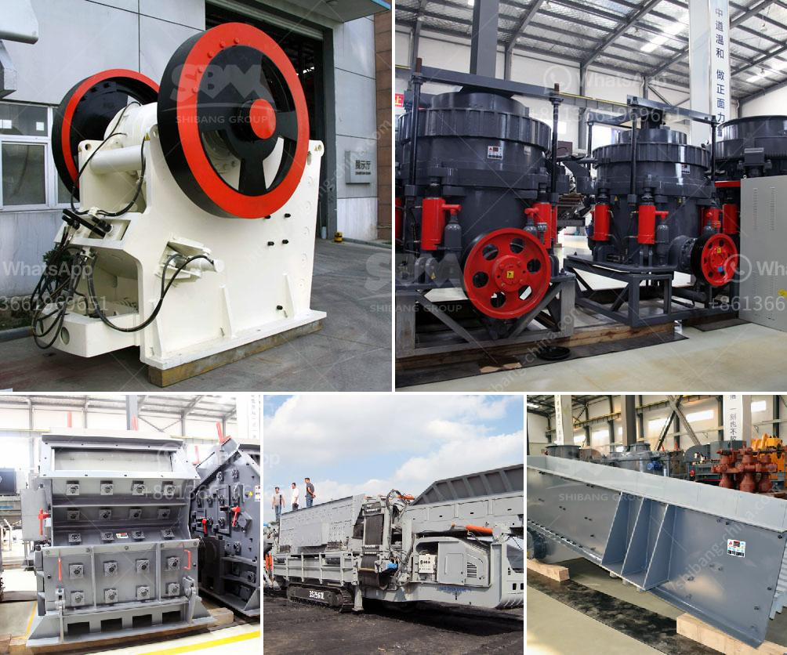

<h3>stone crusher america</h3>
Stone crusher, commonly known as stone crushing equipment, is widely used in mining, metallurgical, construction, chemical and other industries. Stone crusher America explores the history of American industry from the perspective of the crushing equipment industry, focusing on Charles and George Alexander, directors of the company, as pioneers in their fields.

In the late 19th century, Charles and George Alexander discovered a machine that could break rocks into smaller pieces more efficiently than manual labor. This machine, known as the stone crusher, was groundbreaking for its time and laid the foundation for the entire crushing equipment industry. Today, this stone crusher America has played a crucial role in the development of various industries, especially construction and mining.

The stone crusher America is designed with a hydraulic opening system, which enables easy opening of the crusher chamber for maintenance and cleaning purposes. It also has a hydraulic adjustment system to regulate the size of the output material. This feature allows for greater flexibility in terms of the desired final product size.

The stone crusher America is also equipped with a high-performance motor that provides high efficiency and low power consumption. This ensures that the machine can handle heavy-duty tasks without any hassle. It is also designed to be environmentally friendly, with low noise and vibration levels.

One of the key advantages of the stone crusher America is its mobility. It can be easily transported from one location to another, enabling contractors to crush and recycle materials on-site. This saves time and money, as materials do not need to be transported to a separate crushing facility.

In conclusion, the stone crusher America is a valuable asset for any construction or mining company. Its efficiency, versatility, and mobility make it an ideal choice for crushing a wide range of materials. As the crushing equipment industry continues to evolve, stone crusher America will likely remain at the forefront, providing innovative solutions for the ever-growing demands of the industry.
<h3>Contact us</h3><ul><li><strong>Whatsapp:&nbsp;<a href="https://wa.me/8613661969651">+8613661969651</a></strong></li><li><a href="https://swt.shibang-china.com/?git&amp;zhl&amp;stone crusher america"><strong>Online Service(chat now)</strong></a></li></ul><h3>Related</h3><ul><li><a href='crusher machine in bhutan.md'>crusher machine in bhutan</a></li><li><a href='ball mill grinder.md'>ball mill grinder</a></li><li><a href='granite quarry plants.md'>granite quarry plants</a></li><li><a href='gypsum plant equipment catalogue.md'>gypsum plant equipment catalogue</a></li><li><a href='fly ash crusher unit india.md'>fly ash crusher unit india</a></li></ul>