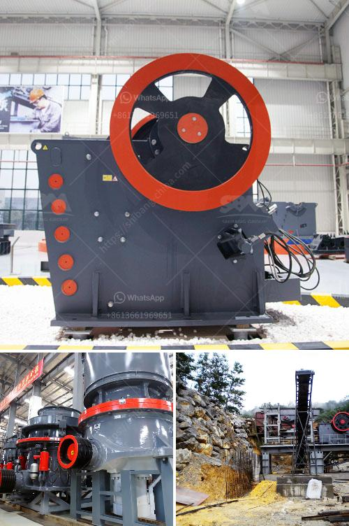

<h3>stone crusher cement factories in africa</h3>
Africa is a growing continent known for its abundant natural resources such as oil, minerals, gold, and diamonds. However, it has been observed that the continent still faces numerous challenges when it comes to infrastructure and development. One of these key challenges is the lack of adequate cement production facilities.

Cement is a crucial building material used in infrastructure projects such as roads, bridges, schools, hospitals, and housing. Its demand continues to rise in Africa due to population growth and urbanization. However, the majority of African countries heavily rely on imported cement, leading to increased costs and delays in construction projects.

To address this issue, several cement factories have been established in Africa to enhance local cement production and reduce the continent's reliance on imports. Stone crusher cement factories, which play a vital role in the production process, help ensure sustainable development of the construction industry.

Stone crushers are powerful machines that break large rocks into smaller pieces, making gravel and other building materials readily available. They operate on mechanical force for breaking apart the large rocks into smaller pieces, reducing them to the desired size or shape for further processing. These crushers are widely used in cement factories to crush limestone, coal, gypsum, and other materials used for making cement.

The establishment of stone crusher cement factories in Africa has significantly contributed to the growth and development of the construction industry. These factories not only produce cement but also provide employment opportunities for local communities, boosting economic growth in the region. Furthermore, the localization of cement production reduces the dependency on imports and promotes self-sufficiency.

Stone crusher cement factories in Africa are strategically located near limestone mines or quarries. Limestone is the primary raw material used in cement production and is abundant in many African countries. These factories source limestone directly from nearby mines, ensuring a steady supply and minimizing transportation costs.

In addition to reducing import reliance, the establishment of stone crusher cement factories has numerous environmental benefits. Locally produced cement reduces carbon emissions associated with long-distance transportation, contributing to a greener and more sustainable future for the continent. Moreover, many factories incorporate modern technologies to minimize energy consumption and waste generation, further mitigating their environmental impact.

Despite the positive impact of stone crusher cement factories, there are still challenges that need to be addressed. Africa's cement industry faces competition from multinational corporations with established supply chains and economies of scale. Local cement factories need to adopt innovative techniques, invest in research, and collaborate with international partners to improve their competitiveness and product quality.

In conclusion, stone crusher cement factories in Africa have played a pivotal role in enhancing the region's construction industry. They have contributed to economic growth, job creation, and reduced import dependency, while supporting environmentally sustainable development. However, to remain competitive, these factories must continue to innovate and collaborate, ensuring long-term growth and success for Africa's cement industry.
<h3>Contact us</h3><ul><li><strong>Whatsapp:&nbsp;<a href="https://wa.me/8613661969651">+8613661969651</a></strong></li><li><a href="https://swt.shibang-china.com/?git&amp;zhl&amp;stone crusher cement factories in africa"><strong>Online Service(chat now)</strong></a></li></ul><h3>Related</h3><ul><li><a href='grinding mill made in germany.md'>grinding mill made in germany</a></li><li><a href='rubber mill grinder.md'>rubber mill grinder</a></li><li><a href='hammer mill prices.md'>hammer mill prices</a></li><li><a href='safety of belt conveyors in hindi.md'>safety of belt conveyors in hindi</a></li><li><a href='jaw crusher for sale in nigeria.md'>jaw crusher for sale in nigeria</a></li></ul>